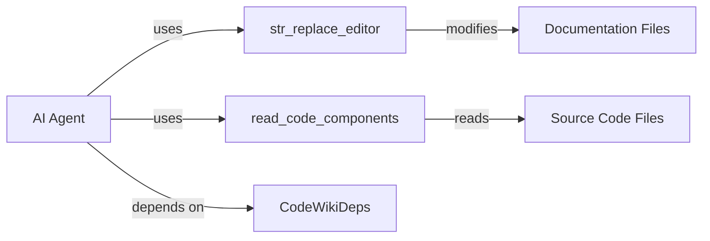

# Agent Tools

The `agent_tools` sub-module provides the necessary tools for AI agents to interact with the repository's codebase and documentation files.

## Core Components

### [`CodeWikiDeps`](../codewiki/src/be/agent_tools/deps.py#L6)

A dataclass that stores the state and dependencies shared with an AI agent. It includes:
- Paths to the documentation and repository root.
- A registry of code components.
- The path to the current module being documented.
- The overall module tree and current generation depth.
- Configuration for LLM services and custom prompt instructions.

### [`str_replace_editor`](../codewiki/src/be/agent_tools/str_replace_editor.py)

The primary tool for interacting with the file system. It provides commands to:
- **`view`**: View the content of a file or the files in a directory.
- **`create`**: Create a new documentation file.
- **`str_replace`**: Replace a unique string in a file with new content.
- **`insert`**: Insert content at a specific line.
- **`undo_edit`**: Revert the last modification to a file.

#### Sub-components within `str_replace_editor`:
- [`EditTool`](../codewiki/src/be/agent_tools/str_replace_editor.py#L349): Implements the file system logic and maintains a history of edits for the `undo` command.
- [`WindowExpander`](../codewiki/src/be/agent_tools/str_replace_editor.py#L235): Intelligently expands the viewing window to include complete functions or classes when viewing code snippets.
- [`Filemap`](../codewiki/src/be/agent_tools/str_replace_editor.py#L197): Generates an abbreviated map of a file's structure using `tree-sitter` for long source files.

### [`read_code_components`](../codewiki/src/be/agent_tools/read_code_components.py)

This tool allows agents to retrieve the source code of specific components for analysis.

### [`generate_sub_module_documentation`](../codewiki/src/be/agent_tools/generate_sub_module_documentations.py)

This tool is used by agents assigned to complex modules to delegate the documentation of their sub-modules. It creates a nested generation job within the orchestrator.

## Tool Safety

To ensure the safety and integrity of the repository:
1.  **Read-only Code Access**: AI agents can only "view" repository files. They cannot modify the original source code.
2.  **Documentation Focus**: The agents' ability to "create" and "edit" files is strictly limited to the documentation directory.
3.  **Verbatim Replacement**: The `str_replace` command requires exact matches to prevent accidental or ambiguous code modifications.

## Component Interaction Diagram

