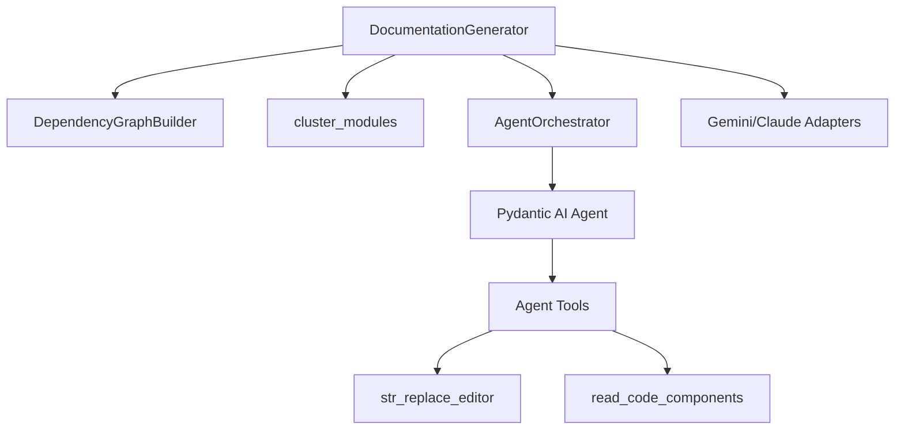
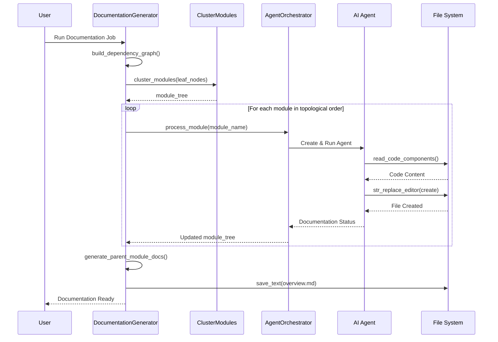

# Backend Module

The `backend` module is the core engine of CodeWiki, responsible for orchestrating the entire documentation generation process. It leverages AI agents and static analysis to transform source code into comprehensive, structured documentation.

## Architecture Overview

The backend follows an orchestration pattern where a central generator manages the workflow, delegating specific tasks to specialized AI agents or external adapters.

### Key Components

1.  **[`DocumentationGenerator`](../codewiki/src/be/documentation_generator.py#L29)**: The main entry point that manages the bottom-up generation of documentation.
2.  **[`AgentOrchestrator`](../codewiki/src/be/agent_orchestrator.py#L62)**: Responsible for creating and configuring AI agents with the appropriate tools and system prompts.
3.  **[`cluster_modules`](../codewiki/src/be/cluster_modules.py)**: A utility to group code components into logical modules based on dependency graphs.
4.  **[`LLM Services`](../codewiki/src/be/llm_services.py)**: Provides a unified interface for calling various LLMs (OpenAI, Gemini, etc.).

## Sub-modules

For detailed information on the specific parts of the backend, refer to the following sub-module documentation:

- **[Backend Orchestration](backend_orchestration.md)**: Details on the high-level workflow managed by the `DocumentationGenerator` and the AI agent management by `AgentOrchestrator`.
- **[Agent Tools](agent_tools.md)**: Documentation of the tools provided to AI agents, including the file editor and code reader.
- **[Dependency Analyzer](dependency_analyzer.md)**: Overview of how the backend maps repository structures and dependencies.

## Workflow

1.  **Static Analysis**: The [`DocumentationGenerator`](../codewiki/src/be/documentation_generator.py#L29) uses the [`DependencyGraphBuilder`](../codewiki/src/be/dependency_analyzer/dependency_graphs_builder.py#L12) to create a map of all components.
2.  **Clustering**: Components are grouped into modules using [`cluster_modules`](../codewiki/src/be/cluster_modules.py).
3.  **Bottom-up Generation**: Documentation is generated starting from leaf modules (modules with no dependencies) up to the repository overview. This ensures that parent modules have access to the documentation of their children for better context.
4.  **Agent Interaction**: For each module, a [`pydantic-ai`](https://pydantic-ai.com) agent is created to analyze the source code and generate a markdown file using specialized tools.

## Visual Documentation

### Document Generation Process

