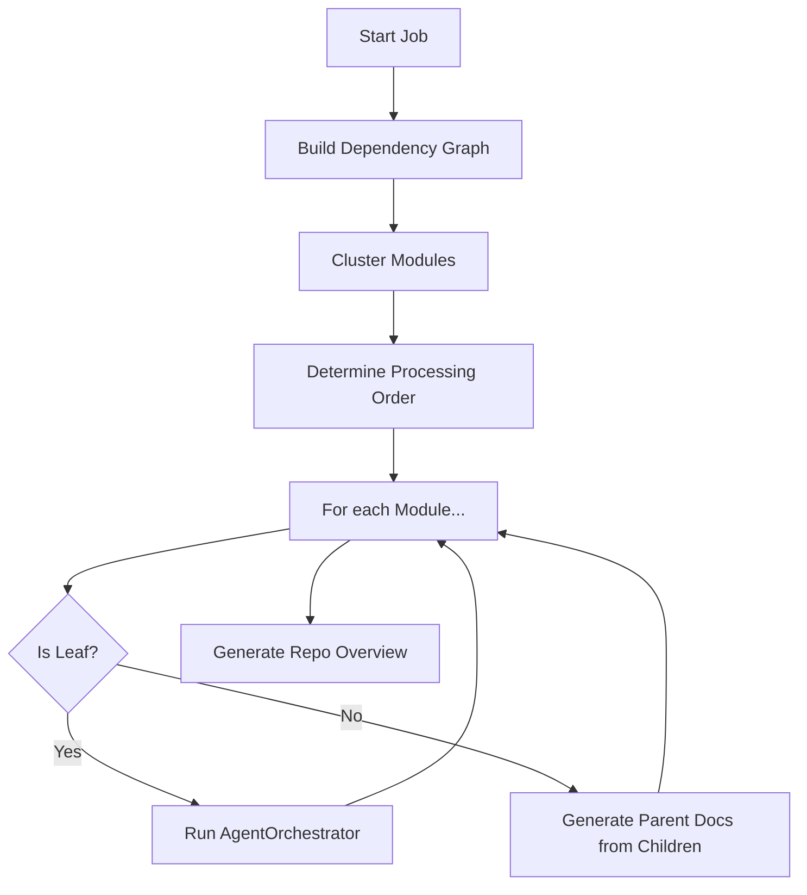

# Backend Orchestration

This section covers the high-level components that manage the documentation generation workflow and orchestrate AI agents.

## Core Components

### [`DocumentationGenerator`](../codewiki/src/be/documentation_generator.py#L29)

The main class that coordinates the overall documentation process. It is responsible for:
- Initializing the [`DependencyGraphBuilder`](../codewiki/src/be/dependency_analyzer/dependency_graphs_builder.py#L12) to understand the codebase structure.
- Determining the **Processing Order** using a topological sort to ensure that dependencies (leaf modules) are documented before their parents.
- Managing the **Clustering** of code components into logical modules.
- Handling the documentation generation for both individual modules and parent overview documents.
- Creating metadata for the documentation generation job.

#### Key Methods:
- `run()`: The entry point for the documentation generation process.
- `get_processing_order()`: Calculates the order in which modules should be processed (bottom-up).
- `generate_module_documentation()`: Iterates through modules and delegates documentation tasks to either an AI agent or a specialized CLI adapter.
- `generate_parent_module_docs()`: Synthesizes high-level documentation for parent modules by using the documentation generated for their children.

### [`AgentOrchestrator`](../codewiki/src/be/agent_orchestrator.py#L62)

The `AgentOrchestrator` manages the creation and execution of `pydantic-ai` agents that perform the actual documentation generation tasks.

#### Responsibilities:
- **Agent Creation**: Creating specialized agents for each module based on its complexity.
- **Tool Configuration**: Attaching relevant tools such as [`str_replace_editor`](agent_tools.md) and `read_code_components` to the agents.
- **Context Injection**: Providing agents with system prompts, module-specific dependencies ([`CodeWikiDeps`](agent_tools.md#codewikideps)), and custom instructions.

#### Module Complexity handling:
- **Complex Modules**: Receive agents equipped with tools to generate sub-module documentation.
- **Leaf Modules**: Receive agents with tools focused on code analysis and file creation.

## Adapters

CodeWiki supports using external AI tools (such as Claude Code or Gemini CLI) for generating documentation. These adapters provide an alternative path when direct AI integration is not used.

- [`claude_code_adapter.py`](../codewiki/src/be/claude_code_adapter.py)
- [`gemini_code_adapter.py`](../codewiki/src/be/gemini_code_adapter.py)

## Process Flow

The following diagram illustrates how the `DocumentationGenerator` manages the workflow.

