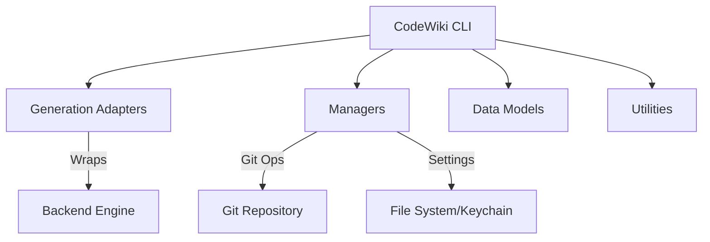

# CodeWiki CLI Module

## Introduction
The `cli` module is the user-facing interface of CodeWiki. It orchestrates the entire documentation lifecycle—from repository analysis and LLM-powered clustering to markdown generation and static HTML hosting. It is designed to be highly configurable, secure, and developer-friendly.

## Architecture Overview
The CLI follows a modular architecture where responsibilities are clearly separated between configuration management, git integration, and generation orchestration.

## Sub-Module Summaries

### [Models](cli_models.md)
Defines the core data structures used throughout the CLI.
- **[`Configuration`](../codewiki/cli/models/config.py#L106)**: Manages LLM settings and project limits.
- **[`DocumentationJob`](../codewiki/cli/models/job.py#L48)**: Tracks the state and metadata of a documentation run.

### [Generation Adapters](cli_generators.md)
Bridges the CLI to the backend and handles visual outputs.
- **[`CLIDocumentationGenerator`](../codewiki/cli/adapters/doc_generator.py#L26)**: Orchestrates the backend calls with progress tracking.
- **[`HTMLGenerator`](../codewiki/cli/html_generator.py#L13)**: Produces the static GitHub Pages viewer.

### [Infrastructure](cli_infrastructure.md)
Handles the underlying system and environment integrations.
- **[`ConfigManager`](../codewiki/cli/config_manager.py#L26)**: Securely manages API keys and local settings.
- **[`GitManager`](../codewiki/cli/git_manager.py#L14)**: Automates branching and committing documentation.

### [Utilities](cli_infrastructure.md#utility-components)
Provides user feedback and logging mechanisms.
- **[`ProgressTracker`](../codewiki/cli/utils/progress.py#L11)**: Manages multi-stage ETA and progress reporting.
- **[`CLILogger`](../codewiki/cli/utils/logging.py#L11)**: Standardizes colored console output.

## Core Component Interaction
The CLI's primary entry point is the `generate` command, which utilizes the [`CLIDocumentationGenerator`](../codewiki/cli/adapters/doc_generator.py#L26). This generator leverages the [`ConfigManager`](../codewiki/cli/config_manager.py#L26) for credentials and the backend [`DocumentationGenerator`](../codewiki/src/be/documentation_generator.py#L29) for the heavy lifting of analysis and LLM interaction. If requested, the [`GitManager`](../codewiki/cli/git_manager.py#L14) handles the creation of a documentation branch to keep the main codebase clean.

## System Dependencies
The CLI module interacts with several other parts of the system:
- **[Backend](backend.md)**: For core documentation and clustering logic.
- **[Dependency Analyzer](dependency_analyzer.md)**: For source code parsing and graph building.
- **[Core Utils](core.md)**: For file system operations and shared configuration defaults.
