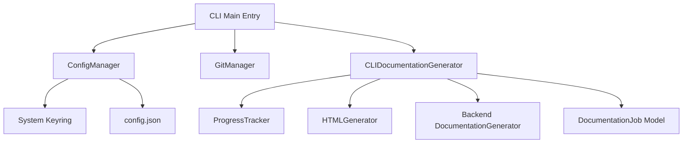

# cli
The **cli** module provides the command-line interface for CodeWiki, managing user configurations, secure credential storage, and orchestrating the documentation generation process with detailed progress feedback.

## Overview
The **cli** module serves as the primary gateway for developers to interact with CodeWiki. It abstracts the complexities of the underlying documentation engine and dependency analysis tools, providing a streamlined workflow for generating and hosting technical documentation.

Key responsibilities include:
- Managing persistent user settings and secure API keys via system keyrings.
- Interacting with Git repositories to handle branch creation and automated commits.
- Orchestrating the multi-stage generation pipeline with real-time progress tracking.
- Generating static HTML viewers for seamless hosting on platforms like GitHub Pages.

---

## Architecture
The CLI is architected as a set of decoupled managers and adapters that coordinate the documentation lifecycle.

The module follows a layered approach where **Adapters** bridge the CLI environment to the backend, **Managers** handle system-level interactions (Git, Keyring), and **Models** define the data structures for configuration and job tracking.

---

## Core Components

> **Start here:** [`CLIDocumentationGenerator`](../codewiki/cli/adapters/doc_generator.py#L26) — read its [`generate()`](../codewiki/cli/adapters/doc_generator.py#L106) method first to understand the orchestration flow.

### CLI Adapters

#### [`CLIDocumentationGenerator`](../codewiki/cli/adapters/doc_generator.py#L26)
The **CLIDocumentationGenerator** is the central orchestrator for the CLI. It wraps the backend [`DocumentationGenerator`](../codewiki/src/be/documentation_generator.py#L29) and adds CLI-specific features like colored logging and multi-stage progress reporting.

- **Primary Method**: [`generate()`](../codewiki/cli/adapters/doc_generator.py#L106) runs the full documentation pipeline and returns a completed [`DocumentationJob`](../codewiki/cli/models/job.py#L48).
- **Stage Tracking**: It uses [`ProgressTracker`](../codewiki/cli/utils/progress.py#L11) to manage phases like Dependency Analysis, Module Clustering, and Document Generation.

### Configuration Management

#### [`ConfigManager`](../codewiki/cli/config_manager.py#L26)
The **ConfigManager** handles persistent settings. It uses the `keyring` library to securely store API keys in the system's native keychain while keeping non-sensitive settings in a local JSON file.

- **Primary Method**: [`load()`](../codewiki/cli/config_manager.py#L55) reads settings from disk and the system keychain, returning `True` if a valid configuration is found.
- **Secure Storage**: It utilizes [`get_api_key()`](../codewiki/cli/config_manager.py#L173) to retrieve credentials without exposing them in plaintext files.

### Git & HTML Utilities

#### [`GitManager`](../codewiki/cli/git_manager.py#L14)
The **GitManager** provides an interface for repository operations, ensuring that documentation is generated against a known state and can be automatically committed.

- **Primary Method**: [`create_documentation_branch()`](../codewiki/cli/git_manager.py#L74) creates a new timestamped branch to isolate documentation changes from the main code.
- **Commit Automation**: [`commit_documentation()`](../codewiki/cli/git_manager.py#L125) handles the staging and committing of the output directory.

#### [`HTMLGenerator`](../codewiki/cli/html_generator.py#L13)
The **HTMLGenerator** transforms the generated markdown into a rich, interactive static viewer.

- **Primary Method**: [`generate()`](../codewiki/cli/html_generator.py#L79) produces an `index.html` file that embeds the project's module tree and metadata for client-side rendering.
- **Metadata Integration**: It uses [`load_metadata()`](../codewiki/cli/html_generator.py#L58) to include generation statistics and model info in the viewer.

### Data Models

#### [`Configuration`](../codewiki/cli/models/config.py#L111)
The **Configuration** model defines the schema for user settings, bridging CLI preferences to backend requirements.

- **Primary Method**: [`to_backend_config()`](../codewiki/cli/models/config.py#L162) converts persistent settings into a runtime [`Config`](../codewiki/src/config.py#L52) object.

#### [`DocumentationJob`](../codewiki/cli/models/job.py#L48)
The **DocumentationJob** represents a single execution of the generator, tracking its state, results, and performance statistics.

- **Status Tracking**: Uses [`JobStatus`](../codewiki/cli/models/job.py#L13) to indicate the current phase (PENDING, RUNNING, COMPLETED, or FAILED).
- **Statistics**: Holds a [`JobStatistics`](../codewiki/cli/models/job.py#L31) object with details like total files analyzed and tokens used.

### UI & Progress

#### [`ProgressTracker`](../codewiki/cli/utils/progress.py#L11)
The **ProgressTracker** provides high-level visual feedback during the long-running generation process.

- **Primary Method**: [`start_stage()`](../codewiki/cli/utils/progress.py#L56) updates the terminal output to reflect the current phase of the pipeline.
- **Detailed Progress**: For individual file generation, the [`ModuleProgressBar`](../codewiki/cli/utils/progress.py#L176) provides a granular view of the progress.

---

## Usage & Extension

### Configuration
The CLI is configured via the [`Configuration`](../codewiki/cli/models/config.py#L111) model.

| Parameter | Type | Default | Description |
|-----------|------|---------|-------------|
| `base_url` | String | (empty) | LLM API base URL |
| `main_model` | String | (empty) | Primary model for documentation generation |
| `cluster_model` | String | (empty) | Model used for hierarchical clustering |
| `max_depth` | Integer | 2 | Maximum depth for module decomposition |
| `max_tokens` | Integer | 32768 | Maximum tokens allowed for LLM responses |

### Extension Points
The CLI module can be extended to support new workflows:
1. **New Adapters**: Implement a new adapter similar to [`CLIDocumentationGenerator`](../codewiki/cli/adapters/doc_generator.py#L26) to support CI/CD environments or different UI frameworks.
2. **Custom Instructions**: Extend [`AgentInstructions`](../codewiki/cli/models/config.py#L21) to allow users to provide domain-specific prompts or filtering rules.
3. **Custom Logging**: Inherit from [`CLILogger`](../codewiki/cli/utils/logging.py#L11) to redirect output to external monitoring systems or file-based logs.

### Error Handling
The module defines specific exceptions to handle various failure modes:
- [`ConfigurationError`](../codewiki/cli/utils/errors.py): Raised by [`ConfigManager`](../codewiki/cli/config_manager.py#L26) when settings are invalid or the keychain is inaccessible.
- [`RepositoryError`](../codewiki/cli/utils/errors.py): Raised by [`GitManager`](../codewiki/cli/git_manager.py#L14) when the project directory is not a valid git repo or has uncommitted changes.
- [`APIError`](../codewiki/cli/utils/errors.py): Raised by [`CLIDocumentationGenerator`](../codewiki/cli/adapters/doc_generator.py#L26) if the backend LLM services return unexpected errors.

---

## Integration
The CLI module orchestrates the following components of the system:
- [**Documentation Engine**](documentation_engine.md): CLI-initiated jobs invoke the core [`DocumentationGenerator`](../codewiki/src/be/documentation_generator.py#L29) logic.
- [**Dependency Analysis Core**](dependency_analysis_core.md): The [`CLIDocumentationGenerator`](../codewiki/cli/adapters/doc_generator.py#L26) triggers dependency graph construction via the backend.
- [**Core System Utilities**](core_system_utilities.md): Persistent CLI settings are converted into global [`Config`](../codewiki/src/config.py#L52) instances for backend use.