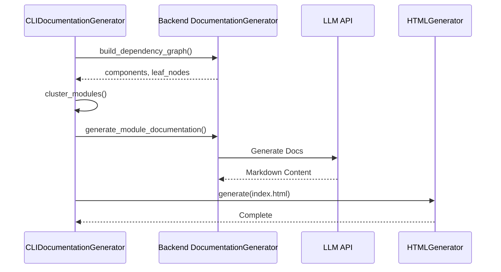

# CLI Generation Adapters

The generation sub-module contains the primary adapters that connect the CLI to the backend documentation engine and handle the production of visual documentation.

## Core Components

### [`CLIDocumentationGenerator`](../codewiki/cli/adapters/doc_generator.py#L26)
This is the central orchestrator for the documentation process within the CLI. It wraps the backend [`DocumentationGenerator`](../codewiki/src/be/documentation_generator.py#L29) and adds CLI-specific features like interactive progress tracking and tailored logging.

**Workflow:**
1. **Dependency Analysis**: Invokes the backend to map the project structure.
2. **Module Clustering**: Uses LLMs (or CLI tools like Gemini/Claude) to group components into logical modules.
3. **Documentation Generation**: Executes the documentation agents for each module.
4. **Finalization**: Triggers metadata creation and optional HTML generation.

### [`HTMLGenerator`](../codewiki/cli/html_generator.py#L13)
Responsible for creating a static, searchable documentation viewer designed for hosting on GitHub Pages.

**Key Features:**
- **Template-based Rendering**: Uses a `viewer_template.html` to embed styles and scripts.
- **Repository Detection**: Automatically detects repository name, URL, and GitHub Pages paths using [`GitManager`](../codewiki/cli/git_manager.py#L14).
- **Data Embedding**: Embeds the `module_tree.json` and `metadata.json` directly into the HTML for zero-dependency client-side rendering.

## Generation Process Flow

