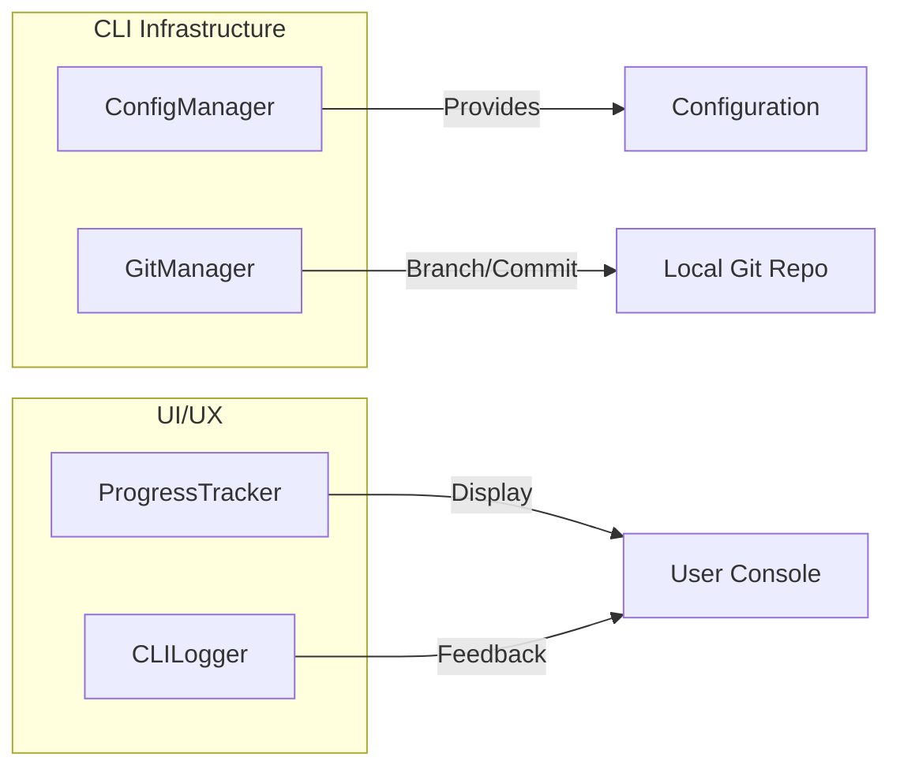

# CLI Infrastructure and Utilities

This section covers the management of configurations, git integration, and CLI-specific utility classes.

## Management Components

### [`ConfigManager`](../codewiki/cli/config_manager.py#L26)
Handles the persistence and retrieval of user settings. It employs a split-storage strategy for security.

- **Non-sensitive settings**: Stored in `~/.codewiki/config.json`.
- **Sensitive settings (API Keys)**: Stored in the system keychain via `keyring`.

**Key Methods:**
- `load()`: Loads configuration from both disk and keychain.
- `save()`: Securely persists settings, ensuring the keychain is used for API keys.
- `get_api_key()`: Retrieves the key from the system keychain.

### [`GitManager`](../codewiki/cli/git_manager.py#L14)
Encapsulates all git-related operations required for a seamless documentation workflow.

- **Integrity Checks**: Ensures the working directory is clean before creating documentation branches.
- **Branch Management**: Creates timestamped branches (e.g., `docs/codewiki-YYYYMMDD`).
- **Committing**: Stages and commits generated documentation to the repository.
- **GitHub Integration**: Generates PR URLs for easy submission.

## Utility Components

### Progress Tracking
The CLI provides rich feedback during the potentially long-running documentation process.

- [`ProgressTracker`](../codewiki/cli/utils/progress.py#L11): Manages the 5 major stages of generation (Analysis, Clustering, Generation, HTML, Finalization). It calculates overall progress based on stage weights.
- [`ModuleProgressBar`](../codewiki/cli/utils/progress.py#L176): A specialized progress bar for the documentation generation stage, showing progress on a per-module basis.

### Logging
- [`CLILogger`](../codewiki/cli/utils/logging.py#L11): A wrapper around `click` for colored console output. It supports different log levels (success, warning, error, debug) and formatted "steps".

## System Integration Diagram

