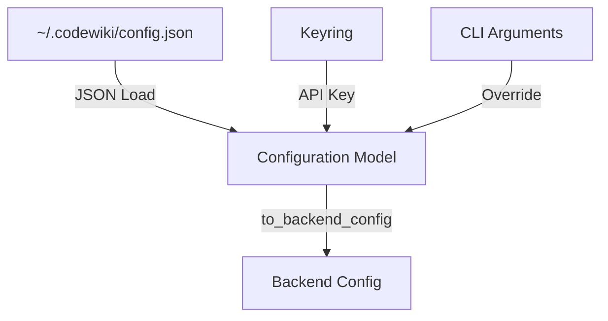

# CLI Models

The `cli.models` sub-module defines the data structures used for managing configurations and tracking documentation jobs within the CLI.

## Configuration Models

These models handle persistent user settings and instructions for the documentation agent.

### [`Configuration`](../codewiki/cli/models/config.py#L106)
The primary configuration model for CodeWiki. It stores LLM settings, model names, and default output paths. It acts as a bridge to the backend [`Config`](../codewiki/src/config.py#L47).

**Key Responsibilities:**
- Validating LLM API URLs and model names.
- Converting CLI-specific settings to backend configuration via `to_backend_config`.
- Managing hierarchical decomposition limits (`max_depth`, `max_tokens`).

### [`AgentInstructions`](../codewiki/cli/models/config.py#L21)
Provides a way for users to customize the documentation process through patterns and specific focus areas.

**Key Features:**
- **File Filtering**: `include_patterns` and `exclude_patterns`.
- **Targeted Documentation**: `focus_modules` and `doc_type` (e.g., API, Architecture).
- **Prompt Customization**: `custom_instructions` passed directly to the LLM agent.

## Job Models

These models track the state and results of a documentation generation process.

### [`DocumentationJob`](../codewiki/cli/models/job.py#L48)
Represents a single execution of the documentation generator. It captures metadata about the repository, git state, and generation progress.

**Properties:**
- `status`: Current [`JobStatus`](../codewiki/cli/models/job.py#L13) (PENDING, RUNNING, COMPLETED, FAILED).
- `files_generated`: A list of all produced markdown and JSON files.
- `statistics`: Instance of [`JobStatistics`](../codewiki/cli/models/job.py#L31).

### Supporting Data Structures
- [`JobStatistics`](../codewiki/cli/models/job.py#L31): Tracks files analyzed, leaf nodes found, and token usage.
- [`GenerationOptions`](../codewiki/cli/models/job.py#L22): Flags for branch creation, GitHub Pages integration, and caching.
- [`LLMConfig`](../codewiki/cli/models/job.py#L40): Captures the specific models and API base URL used for a particular job.

## Diagram: Configuration Flow

