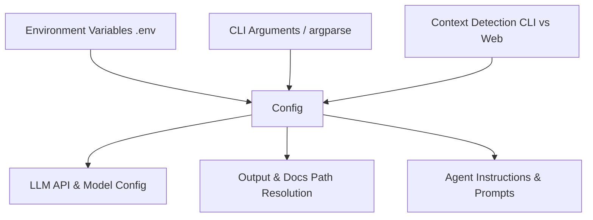

# Config Sub-module Documentation

The Config sub-module is responsible for defining and managing the configuration of the CodeWiki system. It uses environment variables and command-line arguments to initialize the system state, providing a centralized source of truth for all operational parameters.

## Architecture

The [`Config`](../codewiki/src/config.py#L47) class acts as a central configuration store, resolved from multiple sources depending on the execution context.

## Core Components

### [`Config`](../codewiki/src/config.py#L47)
The `Config` class is a dataclass that stores all settings required for the application's operation.

#### Key Responsibilities:
- **Context Management**: Tracks whether the application is running in a CLI or web application context via [`set_cli_context`](../codewiki/src/config.py#L33) and [`is_cli_context`](../codewiki/src/config.py#L38).
- **LLM Service Configuration**: Manages primary and fallback models ([`MAIN_MODEL`](../codewiki/src/config.py#L43), [`FALLBACK_MODEL_1`](../codewiki/src/config.py#L44)), API keys, and base URLs for LLM interactions.
- **Hierarchical Documentation Settings**: Controls the depth of repository exploration ([`MAX_DEPTH`](../codewiki/src/config.py#L18)) and token limits for different levels of documentation clustering ([`DEFAULT_MAX_TOKEN_PER_MODULE`](../codewiki/src/config.py#L22)).
- **Agent Prompt Customization**: Dynamically generates prompt additions based on the desired documentation type (API, architecture, etc.) through [`get_prompt_addition`](../codewiki/src/config.py#L112).
- **Tool Integration**: Manages settings for external CLI tools like Claude Code and Gemini CLI, including executable paths and timeouts.

#### Implementation Details:
- **`from_args`**: A factory method to initialize configuration from standard `argparse` namespaces.
- **`from_cli`**: A more comprehensive factory method used by the [`CLIDocumentationGenerator`](../codewiki/cli/adapters/doc_generator.py#L26) to set up complex generation jobs with specific agent instructions.

## Data Flow
When a documentation job is initiated, the `Config` instance is passed to the [`AgentOrchestrator`](../codewiki/src/be/agent_orchestrator.py#L62), which uses it to determine which LLM to call and how to format the instructions based on the user's specific requirements.
