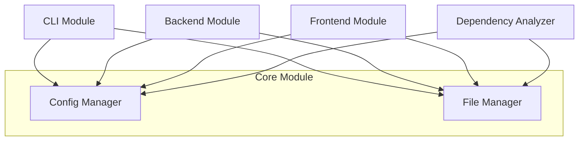

# CodeWiki Core Module Documentation

## Introduction
The Core module is the foundational layer of the CodeWiki system, providing the essential infrastructure required for all other modules. It centralizes configuration management and file system utilities, ensuring that the backend generation processes, CLI tools, and frontend interfaces operate within a consistent environment.

## Architecture Overview
The core module serves as a shared library for the entire application. It defines the global state through configuration and provides common tools for data persistence and file manipulation.

### Module Relationships
- **[CLI](cli.md)**: Uses [`Config`](../codewiki/src/config.py#L47) to parse user inputs and set up documentation generation jobs.
- **[Backend](backend.md)**: Relies on [`Config`](../codewiki/src/config.py#L47) for LLM API access and uses [`FileManager`](../codewiki/src/utils.py#L10) to save generated markdown files.
- **[Dependency Analyzer](dependency_analyzer.md)**: Uses [`FileManager`](../codewiki/src/utils.py#L10) to persist the `module_tree.json` and other intermediate analysis results.
- **[Frontend](frontend.md)**: Accesses configuration settings to manage the web server and background worker processes.

## Sub-Modules

### [Config Manager](config.md)
The Config Manager is responsible for initializing the application state from environment variables and command-line arguments. It handles complex configurations for multiple LLM providers, token limits, and custom agent instructions.

- **Primary Component**: [`Config`](../codewiki/src/config.py#L47)
- **Key Feature**: Context detection (CLI vs. Web) and dynamic prompt generation for AI agents.

### [File Manager](utils.md)
The File Manager provides a set of robust, static methods for common I/O operations. It standardizes how JSON and text files are handled across the codebase, reducing boilerplate code and ensuring cross-platform compatibility.

- **Primary Component**: [`FileManager`](../codewiki/src/utils.py#L10)
- **Key Feature**: Idempotent directory management and safe JSON serialization/deserialization.

## Data Flow
The core module facilitates the following high-level data flow:

1.  **Configuration Loading**: Upon startup, the [`Config`](../codewiki/src/config.py#L47) class loads parameters from `.env` files and CLI arguments.
2.  **Environment Setup**: The [`FileManager`](../codewiki/src/utils.py#L10) creates the necessary output directories (e.g., `output/dependency_graphs/`).
3.  **Cross-Module Support**: The initialized `Config` object is passed to the [`AgentOrchestrator`](../codewiki/src/be/agent_orchestrator.py#L62) and other services to guide their execution.
4.  **Result Persistence**: As analysis and generation tasks complete, results are saved to disk using the [`FileManager`](../codewiki/src/utils.py#L10).
