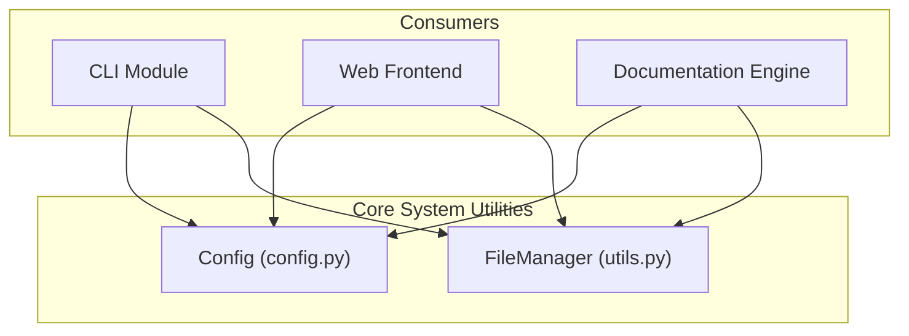

# Core System Utilities

The `core_system_utilities` module provides fundamental configuration management and standardized file I/O operations that support the entire CodeWiki ecosystem. It ensures consistent environment setup and reliable data persistence across CLI and Web execution contexts.

## Overview

This module serves as the foundational layer for CodeWiki, offering centralized configuration handling and robust file system interactions. It acts as the "source of truth" for system-wide constants, LLM parameters, and hierarchical decomposition settings used by the analysis engine.

Key responsibilities include:
- Managing system-wide configuration and environment variable loading.
- Providing hierarchical decomposition parameters for module tree generation.
- Standardizing file operations for JSON and text content.
- Managing execution context states (CLI vs. Web app).

---

## Architecture

The following diagram illustrates how the core utilities interact with the rest of the CodeWiki system.

The module is designed to be lightweight and stateless. **Config** acts as a data container populated from environment variables, CLI arguments, or manual instantiation, while **FileManager** provides static utility methods to abstract boilerplate file operations.

---

## Core Components

> **Start here:** [`Config`](../codewiki/src/config.py#L52) — read its `from_cli()` method first to understand how the system is initialized for a documentation job.

### Config
The [`Config`](../codewiki/src/config.py#L52) class is a centralized dataclass that holds all operational parameters for the CodeWiki engine. It handles repository paths, output directories, and specific LLM configurations required for generation.

- **Primary Method:** [`from_cli()`](../codewiki/src/config.py#L140) - Creates a configuration instance tailored for CLI usage with specific output paths and LLM settings.
- **Primary Method:** [`get_prompt_addition()`](../codewiki/src/config.py#L104) - Generates specialized prompt instructions based on the documentation type (API, architecture, etc.) and focus modules.
- **Primary Method:** [`from_args()`](../codewiki/src/config.py#L118) - Initializes configuration from standard `argparse` namespaces used in the main entry point.

The class provides several properties to extract customization from `agent_instructions`:
- [`include_patterns`](../codewiki/src/config.py#L76): Glob patterns for including specific files during analysis.
- [`exclude_patterns`](../codewiki/src/config.py#L83): Glob patterns for excluding directories or files.
- [`focus_modules`](../codewiki/src/config.py#L90): Specific modules that require more detailed documentation.

### FileManager
The [`FileManager`](../codewiki/src/utils.py#L10) class provides a clean, static interface for common file system tasks. It ensures that directories exist before writing and provides simplified wrappers for JSON and text persistence.

- **Primary Method:** [`save_json()`](../codewiki/src/utils.py#L22) - Serializes data to a JSON file with consistent 4-space indentation.
- **Primary Method:** [`load_json()`](../codewiki/src/utils.py#L28) - Deserializes JSON data, returning `None` if the file is missing rather than raising an exception.
- **Primary Method:** [`ensure_directory()`](../codewiki/src/utils.py#L17) - Idempotently creates directory paths, preventing errors during initialization.

---

## Usage & Extension

### Configuration Parameters
CodeWiki utilizes both environment variables and the `Config` class to manage its behavior.

| Parameter | Type | Default | Description |
|-----------|------|---------|-------------|
| `repo_path` | `str` | N/A | Absolute path to the repository being analyzed. |
| `output_dir` | `str` | `output/temp` | Base directory for generated documentation artifacts. |
| `max_depth` | `int` | `2` | Maximum depth for hierarchical module decomposition. |
| `main_model` | `str` | `claude-sonnet-4` | The primary LLM used for high-quality documentation generation. |
| `max_tokens` | `int` | `32768` | Total token limit for LLM response windows. |

### Environment Variables
The module automatically loads settings from a `.env` file using `load_dotenv()`. Key variables include:
- `MAIN_MODEL`: The default LLM model for generation.
- `LLM_BASE_URL`: The API endpoint for the LLM service provider.
- `LLM_API_KEY`: Authentication credentials for the LLM service.

### Context Management
The system tracks whether it is running in a CLI or Web context via [`set_cli_context()`](../codewiki/src/config.py#L32). This global state allows components to adjust their behavior (e.g., progress bar rendering vs. JSON status updates) based on the environment.

### Error Handling
- [`FileManager.load_json`](../codewiki/src/utils.py#L28) returns `None` for missing files, allowing for optional configuration files.
- Standard file I/O operations in [`FileManager`](../codewiki/src/utils.py#L10) do not catch `PermissionError` or `OSError`, which should be handled by the calling orchestration layer.

---

## Integration

The `core_system_utilities` module is imported by nearly every functional component in CodeWiki:

- [**CLI**](cli.md): Uses `Config` to initialize documentation jobs and `FileManager` to manage local caches and configuration files.
- [**Documentation Engine**](documentation_engine.md): Relies on `Config` for LLM parameters and uses [`get_prompt_addition()`](../codewiki/src/config.py#L104) to inject user preferences into LLM prompts.
- [**Web Frontend**](web_frontend.md): Utilizes `Config` settings for background worker orchestration and temporary directory management.
- [**Dependency Analysis Core**](dependency_analysis_core.md): Uses `FileManager` to persist generated module trees and dependency graphs to the output directory.