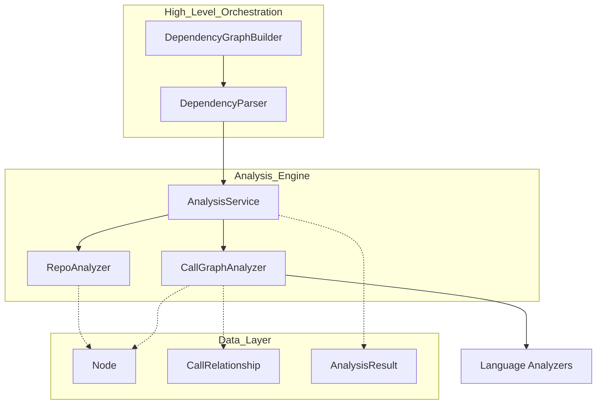

# dependency_analysis_core

The core engine for repository analysis, responsible for structural exploration, AST parsing, and cross-language call graph generation.

## Overview
The `dependency_analysis_core` module provides the foundational tools for understanding a codebase's structure and behavior. It orchestrates the process of identifying source files, extracting functions and classes using language-specific parsers, and resolving relationships between these components to build a comprehensive dependency graph. This module serves as the technical backbone for documentation generation and codebase visualization across the system.

## Architecture

The system follows a layered approach where high-level builders delegate to specialized services. The **DependencyGraphBuilder** initiates the process, using the **DependencyParser** to extract technical components. These components are processed by the **AnalysisService**, which coordinates file discovery via the **RepoAnalyzer** and structural analysis via the **CallGraphAnalyzer**.

---

## Core Components

> **Start here:** [`DependencyGraphBuilder`](../codewiki/src/be/dependency_analyzer/dependency_graphs_builder.py#L16) — read its [`build_dependency_graph()`](../codewiki/src/be/dependency_analyzer/dependency_graphs_builder.py#L23) first.

### DependencyGraphBuilder
The **DependencyGraphBuilder** is the primary entry point for full-system analysis. It manages the high-level workflow of parsing a repository, saving the resulting graph, and identifying "leaf nodes" (typically classes or functions) that serve as starting points for documentation.

- [`build_dependency_graph()`](../codewiki/src/be/dependency_analyzer/dependency_graphs_builder.py#L23): Orchestrates the full analysis and returns a tuple of components and leaf nodes.

### DependencyParser
The **DependencyParser** bridges the gap between raw analysis results and the system's internal [`Node`](../codewiki/src/be/dependency_analyzer/models/core.py#L7) models. It translates the raw function and relationship data into a structured component map used by the rest of the application.

- [`parse_repository()`](../codewiki/src/be/dependency_analyzer/ast_parser.py#L38): Scans the repository and builds a dictionary of code components.
- [`save_dependency_graph()`](../codewiki/src/be/dependency_analyzer/ast_parser.py#L137): Persists the analyzed components to a JSON file.

### AnalysisService
The **AnalysisService** is a centralized coordinator for repository analysis. It handles complex operations such as cloning remote repositories, managing temporary directories, and delegating specific analysis tasks to lower-level components.

- [`analyze_repository_full()`](../codewiki/src/be/dependency_analyzer/analysis/analysis_service.py#L98): Performs a complete analysis including cloning, structure discovery, and call graph generation.
- [`analyze_local_repository()`](../codewiki/src/be/dependency_analyzer/analysis/analysis_service.py#L43): Scans a local directory for code components.
- [`cleanup_all()`](../codewiki/src/be/dependency_analyzer/analysis/analysis_service.py#L286): Removes all temporary directories created during analysis.

### CallGraphAnalyzer
The **CallGraphAnalyzer** is responsible for building the relationship map between code components. It routes files to language-specific analyzers and attempts to resolve symbolic references into concrete links.

- [`analyze_code_files()`](../codewiki/src/be/dependency_analyzer/analysis/call_graph_analyzer.py#L30): Processes a list of files to extract functions and their call sites.
- [`extract_code_files()`](../codewiki/src/be/dependency_analyzer/analysis/call_graph_analyzer.py#L71): Filters the repository file tree for supported source code files.

### RepoAnalyzer
The **RepoAnalyzer** performs filesystem-level exploration. It recursively traverses directories while applying inclusion and exclusion patterns to build a clean representation of the project structure.

- [`analyze_repository_structure()`](../codewiki/src/be/dependency_analyzer/analysis/repo_analyzer.py#L35): Returns a nested dictionary representing the file tree and basic statistics.

### Data Models
The module relies on several Pydantic-based models to ensure type safety and structured data transfer across the system.

- [`Node`](../codewiki/src/be/dependency_analyzer/models/core.py#L7): Represents a single code component (function, class, method) with metadata, line numbers, and source code.
- [`CallRelationship`](../codewiki/src/be/dependency_analyzer/models/core.py#L46): Defines a link between two nodes, indicating a caller-callee relationship.
- [`Repository`](../codewiki/src/be/dependency_analyzer/models/core.py#L56): Stores metadata about the analyzed repository, including its URL and local clone path.
- [`AnalysisResult`](../codewiki/src/be/dependency_analyzer/models/analysis.py#L6): A container for the complete analysis payload.

---

## Usage & Extension
Developers typically interact with this module via the [`DependencyGraphBuilder`](../codewiki/src/be/dependency_analyzer/dependency_graphs_builder.py#L16).

### Configuration
The analysis behavior is controlled through the global [`Config`](../codewiki/src/config.py#L52) object or direct parameters passed to the services.

| Parameter | Type | Default | Description |
| :--- | :--- | :--- | :--- |
| `include_patterns` | `List[str]` | `None` | Glob patterns for files to include in analysis. |
| `exclude_patterns` | `List[str]` | `None` | Patterns to ignore during scanning (e.g., `tests/`, `node_modules/`). |
| `max_files` | `int` | `100` | Hard limit for local analysis to prevent performance degradation. |

### Extension Points
To add support for a new programming language to the core analysis engine:
1. Implement a new language-specific analyzer (e.g., following the pattern of [`PythonASTAnalyzer`](../codewiki/src/be/dependency_analyzer/analyzers/python.py#L15)).
2. Register the new language and its extensions in the [`core_system_utilities`](core_system_utilities.md) pattern map.
3. Update the [`_filter_supported_languages()`](../codewiki/src/be/dependency_analyzer/analysis/analysis_service.py#L261) method in **AnalysisService** to include the new language.
4. Add a specific routing method (e.g., [`_analyze_python_file()`](../codewiki/src/be/dependency_analyzer/analysis/call_graph_analyzer.py#L123)) to the [`CallGraphAnalyzer`](../codewiki/src/be/dependency_analyzer/analysis/call_graph_analyzer.py#L20) class.

### Error Handling
The module uses a robust logging strategy powered by the [`ColoredFormatter`](../codewiki/src/be/dependency_analyzer/utils/logging_config.py#L35) for real-time feedback.
- **Fail-Safe Parsing**: Errors during individual file parsing (e.g., syntax errors) are caught in [`_analyze_code_file()`](../codewiki/src/be/dependency_analyzer/analysis/call_graph_analyzer.py#L90), allowing the overall analysis to continue.
- **Cleanup Guarantee**: The **AnalysisService** tracks all temporary directories and ensures they are removed via [`cleanup_all()`](../codewiki/src/be/dependency_analyzer/analysis/analysis_service.py#L286) during the destructor or on failure.
- **Path Security**: All file operations are guarded by path validation utilities to prevent directory traversal attacks during analysis.

---

## Integration
- [`documentation_engine`](documentation_engine.md): Uses the output from this module to identify which components require LLM-generated documentation.
- [`language_analyzers`](language_analyzers.md): Houses the language-specific logic used by the **CallGraphAnalyzer**.
- [`cli`](cli.md): Provides the user interface for initiating repository scans.
- [`core_system_utilities`](core_system_utilities.md): Provides shared configuration and filesystem utility classes.