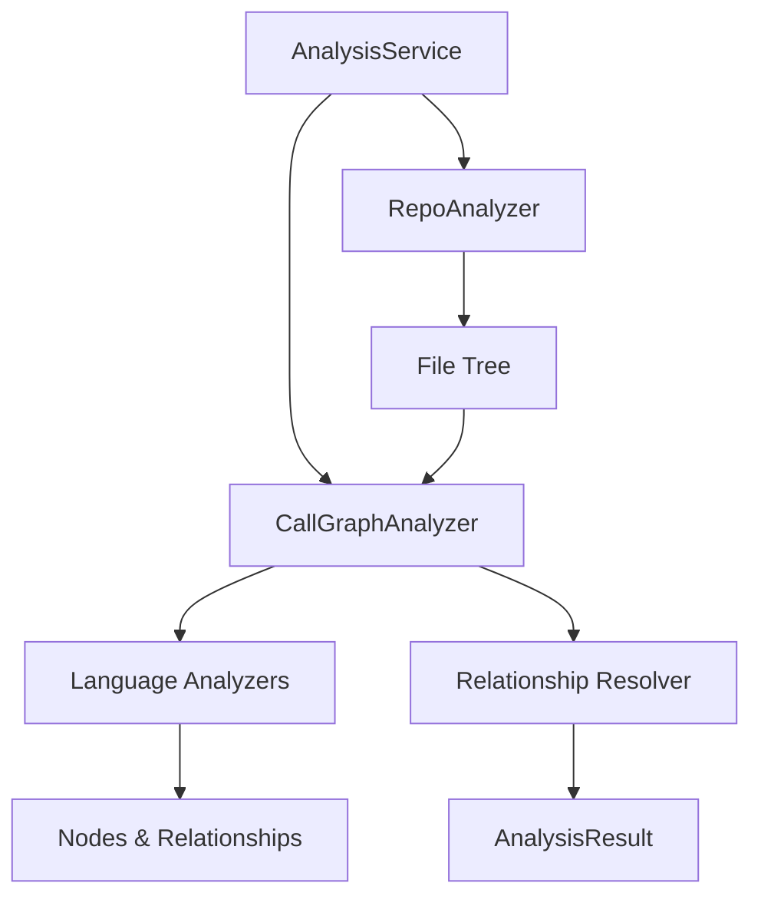
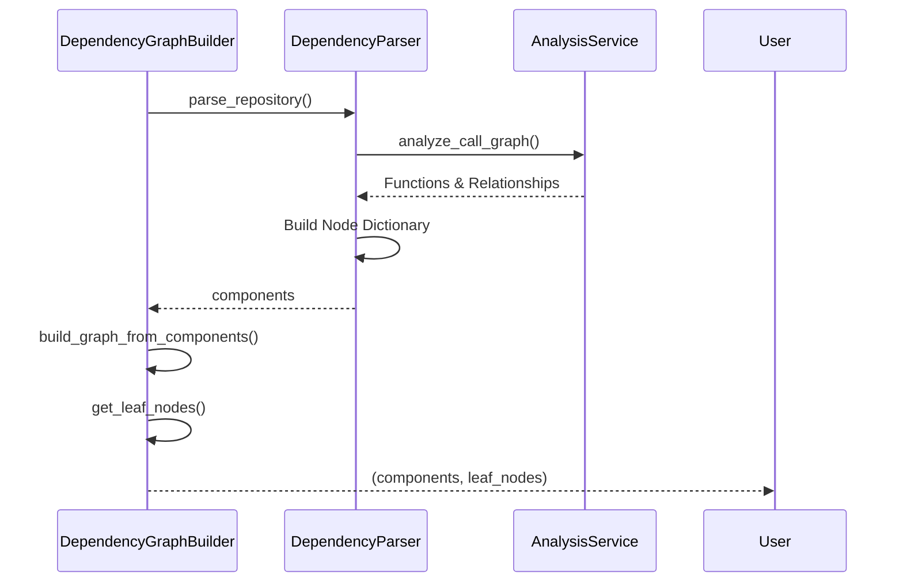
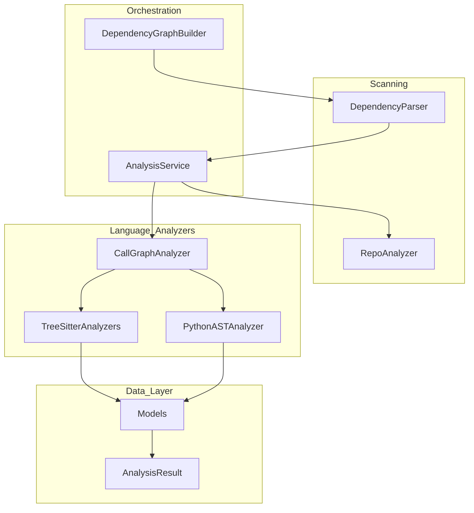

# Analysis Core

The core analysis components provide the orchestration and infrastructure for scanning repositories and generating call graphs.

## Core Components

### [`AnalysisService`](../codewiki/src/be/dependency_analyzer/analysis/analysis_service.py#L24)
The central orchestrator for the analysis workflow. It handles repository cloning, structure analysis, and coordinates multi-language AST parsing.

**Key Responsibilities:**
- Orchestrating the full analysis lifecycle: Clone -> Structure -> Call Graph -> Cleanup.
- Providing high-level APIs for both full analysis and structure-only analysis.
- Managing temporary directories for cloned repositories.
- Filtering files based on supported languages.

### [`CallGraphAnalyzer`](../codewiki/src/be/dependency_analyzer/analysis/call_graph_analyzer.py#L20)
The central manager for language-specific analysis. It routes files to the appropriate analyzer and aggregates the results into a unified graph.

**Key Responsibilities:**
- Extracting code files from the repository tree based on [`CODE_EXTENSIONS`](../codewiki/src/be/dependency_analyzer/utils/patterns.py).
- Dispatching files to specialized analyzers like [`PythonASTAnalyzer`](../codewiki/src/be/dependency_analyzer/analyzers/python.py#L15) or [`TreeSitterTSAnalyzer`](../codewiki/src/be/dependency_analyzer/analyzers/typescript.py#L17).
- Resolving call relationships across different files and components.
- Generating visualization data for graph rendering (Cytoscape format).

### [`RepoAnalyzer`](../codewiki/src/be/dependency_analyzer/analysis/repo_analyzer.py#L16)
Handles filesystem-level scanning and filtering.

**Key Responsibilities:**
- Building a recursive file tree of the repository.
- Applying include/exclude patterns to filter relevant source code.
- Calculating repository statistics (total files, size).

## Workflow Diagram



## Related Modules
- Detailed language parsing logic: [language_analyzers.md](language_analyzers.md)
- Data structures: [models.md](models.md)
```

### 2. Language Analyzers Documentation

Next, I'll document the specialized language analyzers in `language_analyzers.md`.

```markdown
# Language Analyzers

The `dependency_analyzer` uses a pluggable architecture of language-specific analyzers to extract nodes (classes, functions, methods) and call relationships from source code.

## Tree-Sitter Based Analyzers
Most modern languages are supported via [Tree-Sitter](https://tree-sitter.github.io/tree-sitter/), providing robust and fast AST parsing.

| Language | Component | Implementation |
| :--- | :--- | :--- |
| **C** | [`TreeSitterCAnalyzer`](../codewiki/src/be/dependency_analyzer/analyzers/c.py#L13) | Extracts functions, structs, and global variables. |
| **C++** | [`TreeSitterCppAnalyzer`](../codewiki/src/be/dependency_analyzer/analyzers/cpp.py#L13) | Supports classes, methods, inheritance, and namespaced functions. |
| **C#** | [`TreeSitterCSharpAnalyzer`](../codewiki/src/be/dependency_analyzer/analyzers/csharp.py#L13) | Extracts classes, interfaces, records, and properties. |
| **Java** | [`TreeSitterJavaAnalyzer`](../codewiki/src/be/dependency_analyzer/analyzers/java.py#L13) | Maps class hierarchies, implementations, and method invocations. |
| **JavaScript** | [`TreeSitterJSAnalyzer`](../codewiki/src/be/dependency_analyzer/analyzers/javascript.py#L18) | Supports modern JS, arrow functions, and JSDoc type dependencies. |
| **TypeScript** | [`TreeSitterTSAnalyzer`](../codewiki/src/be/dependency_analyzer/analyzers/typescript.py#L17) | Extensive support for types, interfaces, and ambient declarations. |
| **PHP** | [`TreeSitterPHPAnalyzer`](../codewiki/src/be/dependency_analyzer/analyzers/php.py#L87) | Uses [`NamespaceResolver`](../codewiki/src/be/dependency_analyzer/analyzers/php.py#L40) to handle PHP namespacing and use statements. |

## AST Based Analyzers
Python is handled via the native `ast` module for deeper semantic integration.

### [`PythonASTAnalyzer`](../codewiki/src/be/dependency_analyzer/analyzers/python.py#L15)
A visitor-based analyzer that traverses Python source code to identify:
- Classes and inheritance.
- Top-level and class-level functions (methods).
- Cross-component function calls, filtering out Python built-ins.

## Analysis Logic
Each analyzer follows a similar pattern:
1. **Node Extraction**: Identify definitions (ClassDef, FunctionDef, etc.) and create [`Node`](../codewiki/src/be/dependency_analyzer/models/core.py#L7) objects.
2. **Relationship Mapping**: Identify usages (Calls, Inheritance, New expressions) and create [`CallRelationship`](../codewiki/src/be/dependency_analyzer/models/core.py#L46) objects.
3. **Module Resolution**: Convert filesystem paths into dot-separated module paths for consistent identification.

## Interaction with Core
The [`CallGraphAnalyzer`](../codewiki/src/be/dependency_analyzer/analysis/call_graph_analyzer.py#L20) acts as the bridge between these specialized analyzers and the rest of the system.
```

### 3. Graph Engine Documentation

I'll create `graph_engine.md` to document how the system builds the final dependency graph.

```markdown
# Graph Engine

The Graph Engine is responsible for high-level repository parsing and the construction of the final dependency graph used for documentation generation.

## Components

### [`DependencyParser`](../codewiki/src/be/dependency_analyzer/ast_parser.py#L18)
High-level parser that wraps the [`AnalysisService`](../codewiki/src/be/dependency_analyzer/analysis/analysis_service.py#L24) to extract a comprehensive set of code components.

**Key Features:**
- **Pattern Filtering**: Supports glob patterns to include or exclude specific files.
- **Component Mapping**: Maps raw analysis functions into standardized [`Node`](../codewiki/src/be/dependency_analyzer/models/core.py#L7) objects.
- **Legacy Support**: Maintains mappings for older ID formats to ensure backward compatibility.
- **Graph Serialization**: Provides functionality to save the analyzed graph to a JSON file.

### [`DependencyGraphBuilder`](../codewiki/src/be/dependency_analyzer/dependency_graphs_builder.py#L12)
Orchestrates the building and saving of dependency graphs, specifically identifying "leaf nodes" (components with no internal dependencies) which are often the starting point for documentation.

**Key Features:**
- **Path Management**: Sanitizes repository names for file paths.
- **Topological Sorting**: Uses `topo_sort` to build the graph and identify leaf nodes.
- **Type Filtering**: Ensures leaf nodes are relevant code components (classes, interfaces, structs).

## Graph Building Process



## Integration
This engine is a core dependency for the [`DocumentationGenerator`](../codewiki/src/be/documentation_generator.py#L29) in the backend, providing the structural data needed to generate documentation in the correct order.
```

### 4. Data Models Documentation

I'll create `models.md` to document the data structures.

```markdown
# Analysis Models

Standardized data structures used throughout the `dependency_analyzer` to represent code components and their relationships.

## Core Models

### [`Node`](../codewiki/src/be/dependency_analyzer/models/core.py#L7)
Represents a single code entity (class, function, method, etc.).

| Field | Description |
| :--- | :--- |
| `id` | Unique identifier (usually dot-separated module path). |
| `name` | The local name of the component. |
| `component_type` | Type of entity (e.g., "class", "function", "interface"). |
| `source_code` | The raw source code of the definition. |
| `depends_on` | A set of component IDs that this node calls or inherits from. |
| `docstring` | Associated documentation comments. |

### [`CallRelationship`](../codewiki/src/be/dependency_analyzer/models/core.py#L46)
Represents a directed link between two code components.

- **`caller`**: ID of the calling component.
- **`callee`**: ID or name of the called component.
- **`is_resolved`**: Boolean indicating if the callee was successfully matched to a definition within the repository.

### [`Repository`](../codewiki/src/be/dependency_analyzer/models/core.py#L56)
Metadata about the repository being analyzed, including URL, name, and temporary clone path.

## Result Models

### [`AnalysisResult`](../codewiki/src/be/dependency_analyzer/models/analysis.py#L6)
The complete output of a repository analysis, containing the repository metadata, the list of nodes, call relationships, file tree, and summary statistics.

### [`NodeSelection`](../codewiki/src/be/dependency_analyzer/models/analysis.py#L18)
A helper model for partial exports or focused documentation, allowing users to select specific nodes and toggle relationship inclusion.
```

### 5. Main Documentation File

Finally, I'll create the main `dependency_analyzer.md` file.

```markdown
# Dependency Analyzer Module

The `dependency_analyzer` is the engine of CodeWiki. It performs deep static analysis of multi-language repositories to build a comprehensive call graph and architectural map.

## Overview

The module uses a combination of standard AST parsing (for Python) and Tree-Sitter (for C, C++, C#, Java, JS, TS, PHP) to understand code structure without execution. It identifies classes, functions, and their interactions, enabling automated documentation generation that respects the system's actual architecture.

## Architecture

The system is organized into four main layers:



## Sub-Modules

### [Analysis Core](analysis_core.md)
The orchestration layer. Contains [`AnalysisService`](../codewiki/src/be/dependency_analyzer/analysis/analysis_service.py#L24) and [`CallGraphAnalyzer`](../codewiki/src/be/dependency_analyzer/analysis/call_graph_analyzer.py#L20), which manage the overall analysis flow.

### [Language Analyzers](language_analyzers.md)
The parsing layer. Contains specialized analyzers for each supported language, responsible for extracting raw nodes and relationships from source files.

### [Graph Engine](graph_engine.md)
The integration layer. Contains [`DependencyParser`](../codewiki/src/be/dependency_analyzer/ast_parser.py#L18) and [`DependencyGraphBuilder`](../codewiki/src/be/dependency_analyzer/dependency_graphs_builder.py#L12), which convert raw analysis results into a structured dependency graph.

### [Data Models](models.md)
The schema layer. Defines the [`Node`](../codewiki/src/be/dependency_analyzer/models/core.py#L7) and [`CallRelationship`](../codewiki/src/be/dependency_analyzer/models/core.py#L46) structures that unify analysis results across different programming languages.

## Key Features
- **Multi-Language Support**: Consistent analysis for Python, C#, Java, C++, PHP, and more.
- **Cross-File Resolution**: Matches function calls to definitions across the entire repository.
- **Visualization Ready**: Generates data compatible with graph visualization libraries like Cytoscape.js.
- **Topological Analysis**: Identifies leaf nodes and inheritance hierarchies to guide documentation workflows.

## Utils
- [`ColoredFormatter`](../codewiki/src/be/dependency_analyzer/utils/logging_config.py#L35): Provides enhanced console logging with color-coded severity levels.
