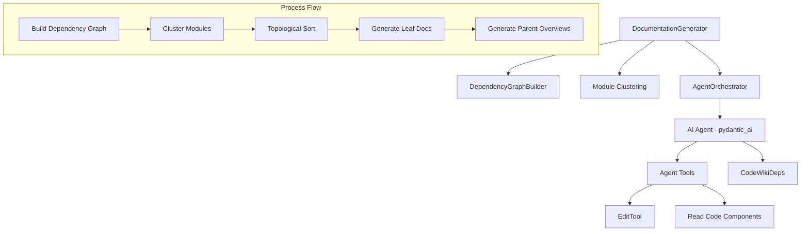

# Documentation Engine

The documentation engine is the core intelligence layer of CodeWiki, responsible for orchestrating AI agents to generate comprehensive system documentation by analyzing code structure and dependencies.

---

## Overview

The **Documentation Engine** acts as the bridge between raw source code analysis and human-readable documentation. It utilizes a dynamic programming approach, processing leaf modules first to build a foundation of knowledge that informs the generation of higher-level parent module overviews and the final repository summary.

Key responsibilities include:
- **Agent Orchestration**: Managing the lifecycle of AI agents using the `pydantic_ai` framework.
- **Topological Generation**: Ensuring modules are documented in dependency order (leaf-to-root).
- **Tool Integration**: Providing agents with specialized tools to read source code and safely edit documentation files.
- **Context Management**: Maintaining a shared state across agent runs to ensure consistency and cross-module referencing.

---

## Architecture

The engine follows a hierarchical orchestration pattern where the main generator delegates complex module analysis to specialized agents.

### Narrative Flow
1. **Analysis**: The [`DocumentationGenerator`](../codewiki/src/be/documentation_generator.py#L30) invokes the [`DependencyGraphBuilder`](../codewiki/src/be/dependency_analyzer/dependency_graphs_builder.py#L16) to map component relationships.
2. **Organization**: Components are grouped into logical modules, and a processing order is determined using a topological sort.
3. **Execution**: The [`AgentOrchestrator`](../codewiki/src/be/agent_orchestrator.py#L62) creates instances of AI agents configured with appropriate system prompts and tools.
4. **Refinement**: Leaf modules are documented using detailed component analysis, while parent modules are synthesized from their children's documentation.

---

## Core Components

> **Start here:** [`DocumentationGenerator`](../codewiki/src/be/documentation_generator.py#L30) — read its `run()` method first to understand the end-to-end documentation workflow.

### DocumentationGenerator
The [`DocumentationGenerator`](../codewiki/src/be/documentation_generator.py#L30) is the high-level coordinator of the entire system. It manages the directory structure, builds the dependency graph, and iterates through the module tree to trigger agent processing.

- **Primary Method**: `run()` triggers the full pipeline from graph building to metadata creation.
- **Key Method**: `get_processing_order()` performs the topological sort to ensure dependencies are documented first.

### AgentOrchestrator
The [`AgentOrchestrator`](../codewiki/src/be/agent_orchestrator.py#L62) handles the instantiation and execution of AI agents. It determines the complexity of a module and assigns the correct system prompts (leaf vs. complex) and toolsets.

- **Primary Method**: `process_module()` creates an agent and runs it against a specific set of code components.
- **Agent Creation**: `create_agent()` configures `pydantic_ai` agents with fallback models and custom instructions.

### CodeWikiDeps
The [`CodeWikiDeps`](../codewiki/src/be/agent_tools/deps.py#L6) dataclass serves as the runtime context for AI agents. It provides agents with paths to the repository, the documentation directory, and the current state of the module tree.

### EditTool & Filesystem Utilities
Agents interact with the documentation files via the [`EditTool`](../codewiki/src/be/agent_tools/str_replace_editor.py#L349). This tool provides a safe interface for viewing, creating, and editing Markdown files using string replacement or line insertion.

- **Supporting Tools**:
    - [`Filemap`](../codewiki/src/be/agent_tools/str_replace_editor.py#L197): Abbreviates large source files for efficient context usage.
    - [`WindowExpander`](../codewiki/src/be/agent_tools/str_replace_editor.py#L235): Expands code viewports to include full class or function definitions.

---

## Usage & Extension

### Configuration
The engine is configured via the [`Config`](../codewiki/src/config.py#L52) object, which defines the LLM models and project paths.

| Parameter | Type | Default | Description |
| :--- | :--- | :--- | :--- |
| `repo_path` | `str` | N/A | Path to the source code to be documented. |
| `docs_dir` | `str` | `docs` | Target directory for the generated wiki. |
| `main_model` | `str` | N/A | The primary LLM used for high-level reasoning. |
| `max_depth` | `int` | `3` | Maximum clustering depth for large projects. |
| `use_gemini_cli` | `bool` | `False` | Enables one-shot predictive generation for speed. |

### Adding New Tools
To extend the agent's capabilities (e.g., adding a diagram generator or an external API checker):
1. Define the tool function using `pydantic_ai` decorators.
2. Add the tool to the `tools` list in [`AgentOrchestrator.create_agent()`](../codewiki/src/be/agent_orchestrator.py#L76).
3. Update the system prompts in [`codewiki.src.be.prompt_template`](../codewiki/src/be/prompt_template.py) to inform the agent of the new capability.

---

## Integration

The Documentation Engine integrates with several other core modules:

- **[CLI](cli.md)**: The user interface that triggers the `DocumentationGenerator`.
- **[Dependency Analysis Core](dependency_analysis_core.md)**: Provides the underlying component graph and AST analysis.
- **[Language Analyzers](language_analyzers.md)**: Used by the analysis core to extract symbols from various programming languages.
- **[Core System Utilities](core_system_utilities.md)**: Provides the [`Config`](../codewiki/src/config.py#L52) and [`FileManager`](../codewiki/src/utils.py#L10) for persistent state.