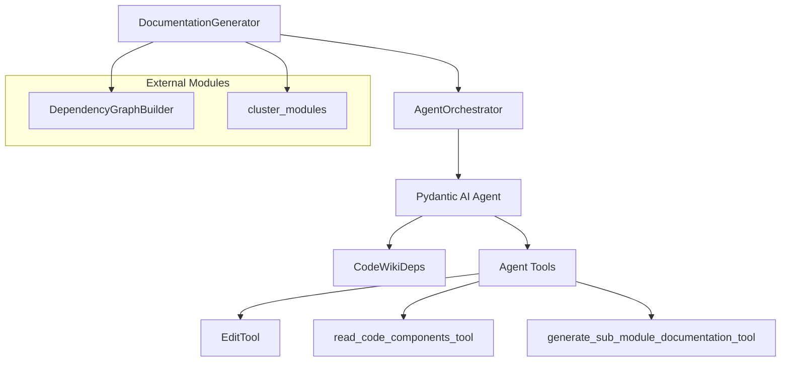

# Documentation Engine

The Documentation Engine is the central orchestration layer of CodeWiki, responsible for managing AI agents that analyze source code and generate structured, hierarchical documentation.

## Overview

The Documentation Engine implements a bottom-up documentation strategy. It leverages dependency analysis to cluster components into logical modules and then employs LLM-powered agents to document them in topological order (leaf modules first). This ensures that parent modules can be documented with full context of their children's functionality.

Key responsibilities include:
- **Orchestration**: Managing the end-to-end flow from dependency graphing to final markdown generation.
- **Agent Management**: Creating and configuring specialized agents based on module complexity.
- **Context Handling**: Preparing and injecting relevant code snippets and dependency data into agent prompts.
- **Tooling**: Providing agents with safe, contextual tools for reading code and editing documentation.

---

## Architecture

The engine follows a layered architecture where the high-level generator coordinates the workflow, the orchestrator manages agent lifecycle, and specialized tools interface with the filesystem.

The **DocumentationGenerator** initializes the process by invoking the [`DependencyGraphBuilder`](dependency_analysis_core.md) and clustering components. It then iterates through the module tree, delegating specific module analysis to the **AgentOrchestrator**.

---

## Core Components

> **Start here:** [`DocumentationGenerator`](../codewiki/src/be/documentation_generator.py#L29) — read its `run()` method first to understand the end-to-end documentation lifecycle.

### DocumentationGenerator
The primary entry point for the documentation system. It handles the high-level logic of building the dependency graph, clustering modules, and determining the processing order.

- **Primary Method**: [`run()`](../codewiki/src/be/documentation_generator.py#L182) — Orchestrates the entire process from dependency analysis to metadata creation.
- **Key Responsibility**: Implements the "Dynamic Programming" approach where leaf modules are documented first, followed by parent summaries.

### AgentOrchestrator
Responsible for the creation and execution of AI agents. It decides the "sophistication" of the agent based on the complexity of the module being documented.

- **Primary Method**: [`process_module()`](../codewiki/src/be/agent_orchestrator.py#L102) — Sets up the environment, creates the agent, and executes the documentation task.
- **Agent Creation**: Uses [`create_agent()`](../codewiki/src/be/agent_orchestrator.py#L75) to attach relevant tools like [`read_code_components_tool`](../codewiki/src/be/agent_tools/read_code_components.py) and [`str_replace_editor_tool`](../codewiki/src/be/agent_tools/str_replace_editor.py).

### CodeWikiDeps
A context-carrying dataclass used by `pydantic-ai` to provide agents with access to repository paths, configuration, and the shared module registry.

- **Location**: [`CodeWikiDeps`](../codewiki/src/be/agent_tools/deps.py#L6)
- **Content**: Includes the absolute documentation path, repository path, module tree, and current analysis depth.

### EditTool
A robust filesystem editor that allows agents to view, create, and modify documentation files safely. It supports "undo" operations and contextual snippets.

- **Primary Method**: [`__call__()`](../codewiki/src/be/agent_tools/str_replace_editor.py#L380) — Dispatches commands such as `view`, `create`, `str_replace`, and `insert`.
- **Safety**: Prevents agents from overwriting files via the `create` command and validates Mermaid diagrams after edits.

### Helper Components
The following utilities support the [`EditTool`](../codewiki/src/be/agent_tools/str_replace_editor.py#L349) in providing efficient context:

1. **[`Filemap`](../codewiki/src/be/agent_tools/str_replace_editor.py#L197)**: Uses tree-sitter to elide function bodies in large files, providing a high-level overview of class structures.
2. **[`WindowExpander`](../codewiki/src/be/agent_tools/str_replace_editor.py#L235)**: Expands requested line ranges to ensure code snippets include complete function or class definitions, preventing fragmented context.

---

## Usage & Extension

### Configuration
The engine is configured via the [`Config`](core_system_utilities.md) object, which defines models, paths, and depth limits.

| Parameter | Type | Default | Description |
|-----------|------|---------|-------------|
| `main_model` | `str` | N/A | Primary LLM used for generation. |
| `max_depth` | `int` | 5 | Maximum depth for recursive sub-module generation. |
| `use_gemini_cli` | `bool` | `False` | If true, uses one-shot generation via Gemini CLI instead of interactive agents. |

### Adding New Tools
To extend the engine with new capabilities (e.g., a tool to search for specific patterns), follow these steps:
1. Define the tool function using the `@tool` decorator or `Tool` class from `pydantic-ai`.
2. Update the [`AgentOrchestrator.create_agent()`](../codewiki/src/be/agent_orchestrator.py#L75) method to include the new tool in the `tools` list.
3. Ensure the tool accepts [`CodeWikiDeps`](../codewiki/src/be/agent_tools/deps.py#L6) if it requires repository context.

---

## Integration

The Documentation Engine sits at the core of the backend, interacting with several other modules:

- **[`dependency_analysis_core`](dependency_analysis_core.md)**: Provides the underlying graph data used to determine module boundaries.
- **[`core_system_utilities`](core_system_utilities.md)**: Provides the [`Config`](../codewiki/src/config.py#L52) and [`FileManager`](../codewiki/src/utils.py#L10) for persistent state and file I/O.
- **[`cli`](cli.md)**: The [`CLIDocumentationGenerator`](../codewiki/src/cli/adapters/doc_generator.py#L26) wraps this engine to provide a terminal interface for users.