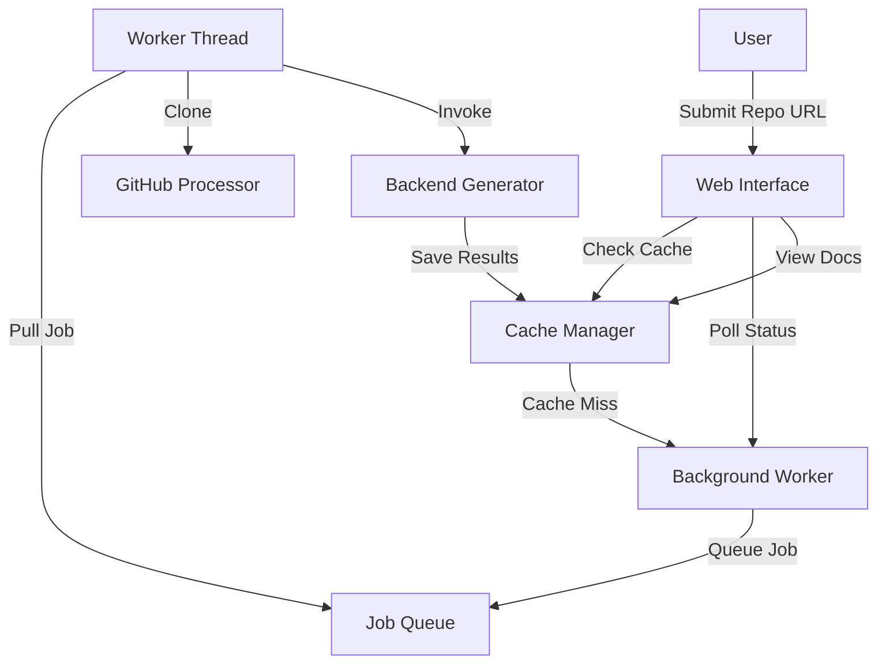

# Frontend Module

The Frontend module provides a web-based interface for the CodeWiki application, allowing users to submit GitHub repositories for documentation generation, monitor job progress, and view the results in a user-friendly format. It acts as an orchestrator between the user and the [Backend](backend.md) documentation generation engine.

## Overview

The module is built with FastAPI and provides both a web interface and a set of background processes to handle potentially long-running documentation tasks. It includes features like caching, repository validation, and asynchronous processing.

## Architecture

The architecture of the frontend module is centered around a task-based processing model where the web layer communicates with a background worker via a shared job queue.

## Sub-Modules

The Frontend module is divided into several specialized sub-modules:

### [Web Interface & Routing](frontend_web_interface.md)
Handles HTTP requests, renders Jinja2 templates, and provides API endpoints for job status tracking.
- **Key Components**: [`WebRoutes`](../codewiki/src/fe/routes.py#L25), [`StringTemplateLoader`](../codewiki/src/fe/template_utils.py#L10)

### [Background Processing](frontend_background_worker.md)
Manages the asynchronous execution of documentation generation tasks using a dedicated worker thread.
- **Key Components**: [`BackgroundWorker`](../codewiki/src/fe/background_worker.py#L26), [`JobStatus`](../codewiki/src/fe/models.py#L33)

### [Cache Management](frontend_cache_management.md)
Optimizes performance by storing and retrieving previously generated documentation results.
- **Key Components**: [`CacheManager`](../codewiki/src/fe/cache_manager.py#L16), [`CacheEntry`](../codewiki/src/fe/models.py#L49)

### [GitHub Processing](frontend_github_processing.md)
Provides utilities for validating GitHub URLs and cloning repositories for analysis.
- **Key Components**: [`GitHubRepoProcessor`](../codewiki/src/fe/github_processor.py#L14)

## Configuration

The module's behavior is governed by the [`WebAppConfig`](../codewiki/src/fe/config.py#L10) class, which defines settings for cache directories, queue sizes, and timeout periods.

## Integration with Other Modules

- **[Backend Module](backend.md)**: The `BackgroundWorker` invokes the [`DocumentationGenerator`](../codewiki/src/be/documentation_generator.py#L29) from the backend to perform the actual analysis and documentation generation.
- **[Core Utilities](core.md)**: Uses [`Config`](../codewiki/src/config.py#L47) for global application settings and [`file_manager`](../codewiki/src/utils.py#L10) for disk I/O operations.

---
*Documentation generated for the CodeWiki Frontend Module.*
