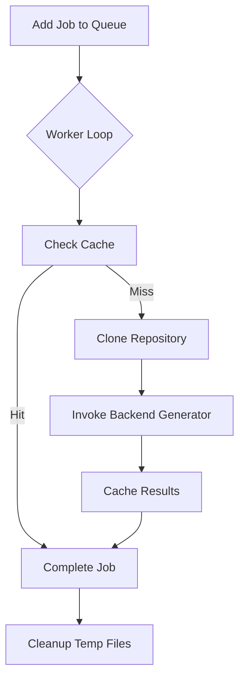

# Frontend Background Worker

The Background Worker sub-module is responsible for the asynchronous execution of documentation generation tasks. It manages a queue of jobs, clones repositories, and invokes the backend's documentation generator.

## Core Components

### [`BackgroundWorker`](../codewiki/src/fe/background_worker.py#L26)
The primary class for managing the background process. Key responsibilities include:
- **Queue Management**: Maintains a processing queue of job IDs.
- **Worker Loop**: A dedicated thread that pulls jobs from the queue and processes them via [`_worker_loop`](../codewiki/src/fe/background_worker.py#L141).
- **Process Job**: Orchestrates the entire lifecycle of a documentation job in [`_process_job`](../codewiki/src/fe/background_worker.py#L153).
- **Persistence**: Saves and loads job statuses from `jobs.json` to ensure persistence across restarts.

### Models
- [`JobStatus`](../codewiki/src/fe/models.py#L33): Tracks the lifecycle of a job, including its status (queued, processing, completed, failed), progress messages, and output paths.

## Job Processing Lifecycle

## Interaction with Other Modules
- **GitHub Interaction**: Uses [`GitHubRepoProcessor`](../codewiki/src/fe/github_processor.py#L14) to clone repositories into temporary directories.
- **Backend Documentation Generation**: Instantiates and runs [`DocumentationGenerator`](../codewiki/src/be/documentation_generator.py#L29) from the [backend module](backend.md).
- **Cache Management**: Checks and updates the cache using [`CacheManager`](../codewiki/src/fe/cache_manager.py#L16).

## Related Modules
- [Frontend Web Interface](frontend_web_interface.md)
- [Frontend Cache Management](frontend_cache_manager.md)
- [Frontend GitHub Processing](frontend_github_processor.md)
- [Backend Documentation Generator](backend.md)
