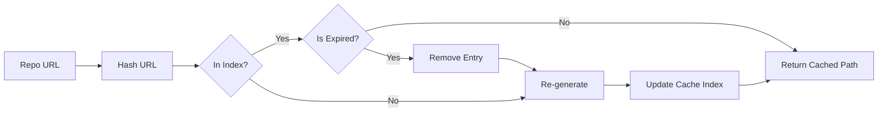

# Frontend Cache Management

The Cache Management sub-module handles the storage and retrieval of generated documentation to avoid redundant processing of the same repository. It ensures that previously generated docs are quickly served to the user.

## Core Components

### [`CacheManager`](../codewiki/src/fe/cache_manager.py#L16)
The primary class for managing the cache. Key responsibilities include:
- **Hashing**: Generates unique hashes for repository URLs via [`get_repo_hash`](../codewiki/src/fe/cache_manager.py#L60) for efficient lookup.
- **Lookup**: Retrieves cached documentation paths via [`get_cached_docs`](../codewiki/src/fe/cache_manager.py#L64).
- **Addition**: Adds new generation results to the cache via [`add_to_cache`](../codewiki/src/fe/cache_manager.py#L82).
- **Cleanup**: Removes expired entries based on [`WebAppConfig.CACHE_EXPIRY_DAYS`](../codewiki/src/fe/config.py#L22).

### Models
- [`CacheEntry`](../codewiki/src/fe/models.py#L49): Represents a single entry in the cache, containing the repository URL, its hash, the path to the documentation, and access timestamps.

## Cache Workflow

## Storage Structure
- **Index File**: `cache_index.json` stores the mapping of URL hashes to their corresponding documentation paths and metadata.
- **Documentation Output**: Generated files are stored in subdirectories under the path specified by [`WebAppConfig.CACHE_DIR`](../codewiki/src/fe/config.py#L14).

## Related Modules
- [Frontend Web Interface](frontend_web_interface.md)
- [Frontend Background Worker](frontend_background_worker.md)
