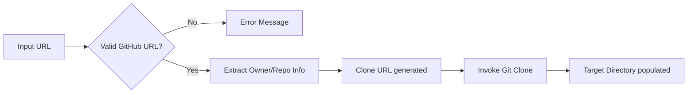

# Frontend GitHub Processing

The GitHub Processing sub-module provides utilities for validating GitHub repository URLs, extracting repository information, and cloning them for documentation generation.

## Core Components

### [`GitHubRepoProcessor`](../codewiki/src/fe/github_processor.py#L14)
A utility class with static methods for GitHub interactions:
- **Validation**: Ensures a provided URL is a valid GitHub repository URL via [`is_valid_github_url`](../codewiki/src/fe/github_processor.py#L17).
- **Metadata Extraction**: Retrieves the owner, repository name, and clone URL from a repository URL via [`get_repo_info`](../codewiki/src/fe/github_processor.py#L35).
- **Repository Cloning**: Handles cloning repositories to temporary directories via [`clone_repository`](../codewiki/src/fe/github_processor.py#L56). This supports both shallow clones (default) and cloning specific commit IDs.

## Interaction Flow

## Related Modules
- [Frontend Background Worker](frontend_background_worker.md)
- [Frontend Web Interface](frontend_web_interface.md)
