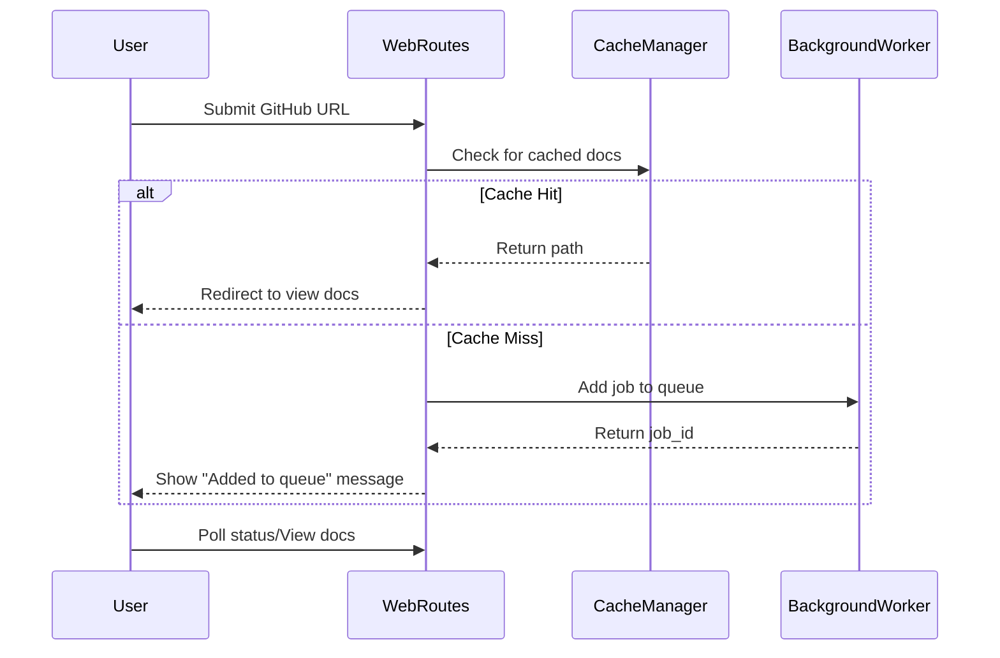

# Frontend Web Interface

The Web Interface sub-module handles the user-facing part of the CodeWiki application, providing a web-based portal for submitting repositories and viewing generated documentation. It is built using FastAPI and Jinja2 templates.

## Core Components

### [`WebRoutes`](../codewiki/src/fe/routes.py#L25)
The primary handler for HTTP requests. It manages:
- **Index Page**: Displays the submission form and a list of recent jobs via [`index_get`](../codewiki/src/fe/routes.py#L35).
- **Repository Submission**: Processes GitHub URL submissions, checks the cache, and queues new jobs via [`index_post`](../codewiki/src/fe/routes.py#L60).
- **Status API**: Provides a JSON endpoint to poll for job progress via [`get_job_status`](../codewiki/src/fe/routes.py#L156).
- **Documentation Viewer**: Serves the generated Markdown files converted to HTML via [`serve_generated_docs`](../codewiki/src/fe/routes.py#L182).

### Models
- [`RepositorySubmission`](../codewiki/src/fe/models.py#L12): Validates the GitHub URL provided in the form.
- [`JobStatusResponse`](../codewiki/src/fe/models.py#L17): Defines the structure of the API response for job status queries.

### Template Utilities
- [`StringTemplateLoader`](../codewiki/src/fe/template_utils.py#L10): A custom Jinja2 loader that allows rendering templates from strings stored in memory.
- [`render_template`](../codewiki/src/fe/template_utils.py#L22): A helper function to process templates with a given context.

## Interaction Flow

## Related Modules
- [Frontend Background Worker](frontend_background_worker.md)
- [Frontend Cache Management](frontend_cache_manager.md)
