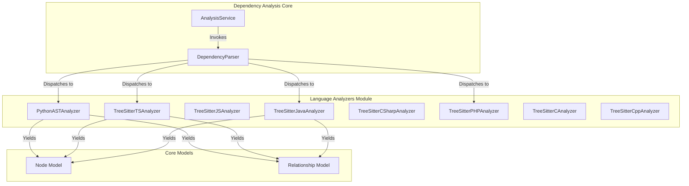

# Language Analyzers

The `language_analyzers` module provides specialized AST-based parsers for extracting code components, structural metadata, and dependency relationships from multiple programming languages.

## Overview

The **language_analyzers** module is a critical subsystem of the CodeWiki backend. Its primary responsibility is to perform deep static analysis on source files using either the built-in Python `ast` module or the `tree-sitter` parsing library. It supports a wide range of languages, including C, C++, C#, Java, JavaScript, PHP, Python, and TypeScript. 

By translating raw source code into a standardized set of [`Node`](../codewiki/src/be/dependency_analyzer/models/core.py#L7) and [`CallRelationship`](../codewiki/src/be/dependency_analyzer/models/core.py#L46) objects, this module enables the [`dependency_analysis_core`](dependency_analysis_core.md) to build unified, cross-language dependency graphs and allows the [`documentation_engine`](documentation_engine.md) to generate rich, context-aware documentation.

---

## Architecture

The module follows a provider pattern where each language-specific analyzer implements a common interface for ingestion by the central analysis services.

Each analyzer takes a file path and its content as input and traverses the resulting AST (Abstract Syntax Tree) to identify top-level declarations (classes, functions, interfaces) and interactions (calls, inheritance, instantiation).

---

## Core Components

> **Start here:** [`PythonASTAnalyzer`](../codewiki/src/be/dependency_analyzer/analyzers/python.py#L15) — read its `analyze()` method first to understand the fundamental pattern of AST traversal and component extraction.

### [`PythonASTAnalyzer`](../codewiki/src/be/dependency_analyzer/analyzers/python.py#L15)
A visitor-based analyzer that utilizes the Python standard library's `ast` module.
- **Key Entry Point**: `analyze()` — Initiates the AST traversal and populates the `nodes` and `call_relationships` lists.
- **Responsibilities**:
  - Traverses the AST using the `NodeVisitor` pattern.
  - Extracts class definitions, base classes, and method metadata.
  - Identifies function and async function declarations.
  - Resolves internal function calls while filtering out Python built-ins.

### [`TreeSitterTSAnalyzer`](../codewiki/src/be/dependency_analyzer/analyzers/typescript.py#L17)
A robust analyzer for TypeScript and TSX files leveraging the `tree-sitter-typescript` grammar.
- **Key Entry Point**: `analyze()` — Performs a multi-pass analysis to extract entities and then resolve their relationships.
- **Responsibilities**:
  - Extracts classes, interfaces, type aliases, and enums.
  - Handles complex TypeScript features like ambient declarations and nested modules.
  - Resolves dependencies from constructor parameter types and type annotations.
  - Filters out local variables and nested functions to focus on top-level architectural components.

### [`TreeSitterJSAnalyzer`](../codewiki/src/be/dependency_analyzer/analyzers/javascript.py#L18)
Analyzes JavaScript and JSX files using `tree-sitter-javascript`.
- **Key Entry Point**: `analyze()` — Parses the AST to find function definitions and call expressions.
- **Responsibilities**:
  - Identifies ES6 class declarations and method definitions.
  - Extracts function declarations and arrow functions.
  - Captures inter-component relationships through call expression analysis.

### [`TreeSitterPHPAnalyzer`](../codewiki/src/be/dependency_analyzer/analyzers/php.py#L87)
Specialized analyzer for PHP source code, supporting namespaces and modern PHP 8+ features.
- **Key Entry Point**: `_analyze()` — Triggers namespace info extraction followed by node and relationship discovery.
- **Responsibilities**:
  - Extracts classes, traits, interfaces, and enums.
  - Handles PHP-specific features like property promotion and scoped calls.
  - Leverages the [`NamespaceResolver`](../codewiki/src/be/dependency_analyzer/analyzers/php.py#L40) to resolve FQNs (Fully Qualified Names).

### [`TreeSitterJavaAnalyzer`](../codewiki/src/be/dependency_analyzer/analyzers/java.py#L13)
Parses Java files using `tree-sitter-java`, focusing on strongly-typed object-oriented structures.
- **Responsibilities**:
  - Extracts classes, records, interfaces, and annotations.
  - Identifies inheritance (`extends`) and interface implementation (`implements`).
  - Resolves method invocations by attempting to determine variable types within blocks.

### [`TreeSitterCSharpAnalyzer`](../codewiki/src/be/dependency_analyzer/analyzers/csharp.py#L13)
Analyzes C# files using `tree-sitter-c-sharp`, supporting standard .NET structural patterns.
- **Responsibilities**: Extracts classes, structs, interfaces, and method declarations with their associated parameters.

### [`TreeSitterCAnalyzer`](../codewiki/src/be/dependency_analyzer/analyzers/c.py#L13) & [`TreeSitterCppAnalyzer`](../codewiki/src/be/dependency_analyzer/analyzers/cpp.py#L13)
Analyzers for C and C++ that handle procedural and object-oriented paradigms.
- **Responsibilities**:
  - Extracts functions, structs, and global variables.
  - Handles C++ namespaces and class/struct specifiers.
  - Filters out common system and library functions (e.g., `printf`, `malloc`, `SDL_Init`).

---

## Usage & Extension

### Extension Points
The module is designed to be extensible to new languages. To add support for a new language (e.g., Go):

1. **Implement Analyzer**: Create `codewiki/src/be/dependency_analyzer/analyzers/go.py` and implement a `TreeSitterGoAnalyzer` class.
2. **Standard Interface**: Ensure the class accepts `file_path`, `content`, and `repo_path` in its constructor.
3. **Node Extraction**: Implement logic to populate `self.nodes` with [`Node`](../codewiki/src/be/dependency_analyzer/models/core.py#L7) instances representing the language's primary constructs (e.g., `struct`, `func`).
4. **Relationship Discovery**: Populate `self.call_relationships` with [`CallRelationship`](../codewiki/src/be/dependency_analyzer/models/core.py#L46) instances for calls and dependencies.
5. **Register**: Add the new analyzer to the [`DependencyParser`](../codewiki/src/be/dependency_analyzer/ast_parser.py#L18) dispatch logic.

### Error Handling
- Analyzers wrap their core logic in `try-except` blocks to prevent single-file syntax errors from crashing the entire analysis job.
- Initialization failures (e.g., missing tree-sitter grammars) are logged via [`CLILogger`](../codewiki/cli/utils/logging.py#L11), and the problematic file is skipped.
- Recursion limits are enforced in languages with deep AST structures (like PHP) to prevent stack overflows.

---

## Integration

- **[`dependency_analysis_core`](dependency_analysis_core.md)**: The [`AnalysisService`](../codewiki/src/be/dependency_analyzer/analysis/analysis_service.py#L24) uses these analyzers via the [`DependencyParser`](../codewiki/src/be/dependency_analyzer/ast_parser.py#L18) to build the initial component map.
- **[`documentation_engine`](documentation_engine.md)**: The nodes produced by this module are enriched by the [`DocumentationGenerator`](../codewiki/src/be/documentation_generator.py#L29) to create final wiki pages.
- **[`core_system_utilities`](core_system_utilities.md)**: Utilizes [`FileManager`](../codewiki/src/utils.py#L10) for reading source content before passing it to the analyzers.