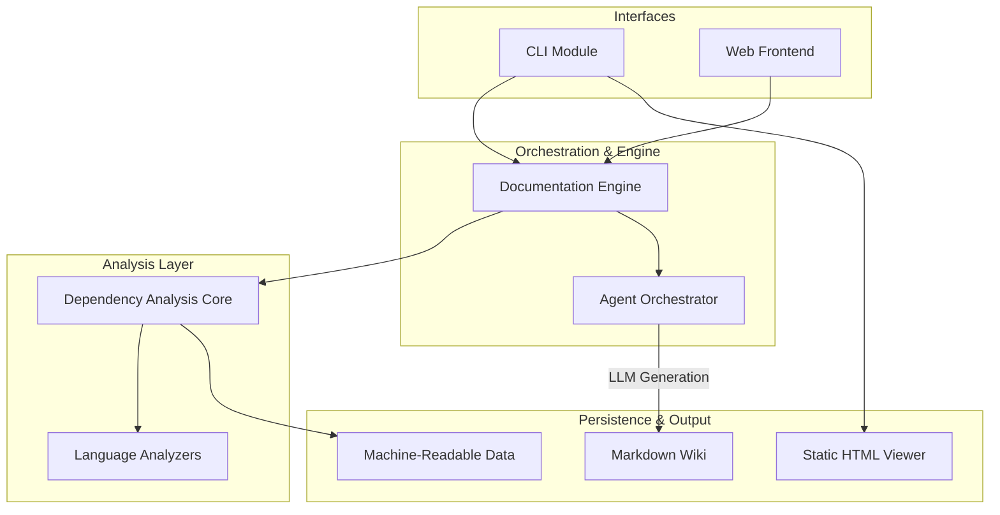

# CodeWiki Overview

CodeWiki is an automated documentation system designed to generate comprehensive, hierarchical technical documentation for software repositories. By combining deep static analysis—including dependency graphing and AST parsing—with LLM-powered AI agents, CodeWiki autonomously discovers the structural relationships within a codebase and produces high-quality Markdown documentation that reflects the project's actual architecture.

## End-to-End Architecture

The following diagram illustrates the high-level architecture and the flow of data from initial repository analysis to the final generated documentation.

## Core Modules

The system is composed of several specialized modules, each documented in detail within the wiki:

- [**CLI**](cli.md): Provides the terminal-based entry point, managing user configurations, secure API keys, and local documentation orchestration.
- [**Documentation Engine**](documentation_engine.md): The central backend orchestrator that manages the documentation lifecycle and coordinates AI agents using a bottom-up strategy.
- [**Dependency Analysis Core**](dependency_analysis_core.md): The engine responsible for structural exploration, file discovery, and building the comprehensive dependency graph.
- [**Language Analyzers**](language_analyzers.md): A collection of specialized AST-based parsers (supporting Python, TypeScript, Java, PHP, C++, etc.) used to extract technical metadata.
- [**Web Frontend**](web_frontend.md): A FastAPI-based web application that allows users to submit GitHub repositories for processing and view the results in a browser.
- [**Core System Utilities**](core_system_utilities.md): Provides foundational configuration management, environment handling, and standardized file I/O operations.

## Supplementary Data

In addition to the human-readable Markdown documentation, this directory contains machine-readable data files intended for programmatic use:

- `module_tree.json`: A hierarchical representation of the project's module structure and the components assigned to each module.
- `dependency_graph.json`: The full dependency graph of the codebase. This file includes every code component (classes, functions, methods), their precise file locations, source code snippets, and their call relationships, facilitating programmatic navigation and deep dependency analysis.