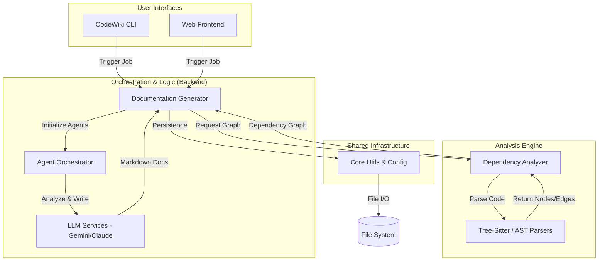

# CodeWiki Repository Overview

## Purpose
CodeWiki is an autonomous, AI-powered documentation engine designed to transform complex source code into structured, human-readable documentation. By combining deep static analysis with LLM-driven agents, CodeWiki maps repository architectures, clusters code into logical modules, and generates comprehensive markdown documentation. It supports multiple languages (Python, Java, C++, TypeScript, etc.) and provides both a developer-friendly CLI and a web-based interface for managing the documentation lifecycle.

## End-to-End Architecture
CodeWiki follows a modular architecture where the frontend/CLI layers capture user intent, the backend orchestrates the AI logic, and the dependency analyzer provides the structural "ground truth" of the codebase.

## Core Modules Documentation

The system is organized into five primary modules, each handling a distinct stage of the documentation pipeline:

| Module | Description | Documentation |
| :--- | :--- | :--- |
| **[CLI](wiki/cli.md)** | The command-line interface for orchestrating the documentation lifecycle, managing configurations, and handling Git integrations. | `codewiki/cli` |
| **[Backend](wiki/backend.md)** | The core engine that manages the bottom-up generation process, clustering modules, and coordinating AI agents. | `codewiki/src/be` |
| **[Dependency Analyzer](wiki/dependency_analyzer.md)** | The static analysis powerhouse that uses Tree-Sitter and AST to build comprehensive call graphs across multiple languages. | `codewiki/src/be/dependency_analyzer` |
| **[Frontend](wiki/frontend.md)** | A FastAPI-powered web application for submitting repositories, monitoring progress, and viewing generated docs. | `codewiki/src/fe` |
| **[Core](wiki/core.md)** | The foundational layer providing shared configuration management and cross-platform file system utilities. | `codewiki/src` |

### Key Workflows
1. **Repository Mapping**: The `Dependency Analyzer` scans the source code to build a `module_tree.json` representing the project's architecture.
2. **AI Documentation**: The `Backend` creates specialized agents for each code cluster. These agents read the code and generate documentation starting from "leaf" nodes (components with no internal dependencies) up to the high-level overview.
3. **Static Hosting**: The `CLI` can generate a static HTML viewer, allowing the documentation to be hosted easily via GitHub Pages or other static site providers.