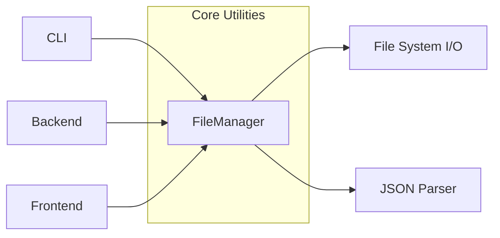

# Utils Sub-module Documentation

The Utils sub-module provides high-level utilities for common tasks such as file system operations, JSON serialization, and data persistence. It aims to provide a consistent and safe way to interact with the file system across all system modules.

## Architecture

The [`FileManager`](../codewiki/src/utils.py#L10) class acts as a stateless service, providing helper methods to other modules.

## Core Components

### [`FileManager`](../codewiki/src/utils.py#L10)
The `FileManager` class is the central component of this sub-module, providing a unified interface for handling files.

#### Key Responsibilities:
- **Safe Directory Creation**: [`ensure_directory`](../codewiki/src/utils.py#L15) provides an idempotent way to create directory structures, ensuring that parent directories exist before any data is written.
- **Data Persistence**: [`save_json`](../codewiki/src/utils.py#L21) and [`save_text`](../codewiki/src/utils.py#L38) simplify saving structured or raw data to disk, handling file handles and formatting.
- **Data Retrieval**: [`load_json`](../codewiki/src/utils.py#L27) and [`load_text`](../codewiki/src/utils.py#L44) provide robust ways to read data from the system, including handling missing files.

## Interaction Flow
When the [`AnalysisService`](../codewiki/src/be/dependency_analyzer/analysis/analysis_service.py#L24) finishes analyzing a repository, it utilizes [`FileManager.save_json`](../codewiki/src/utils.py#L21) to store the dependency graph in the directory specified by the [`Config`](../codewiki/src/config.py#L47)'s `dependency_graph_dir`. This demonstrates the collaborative relationship between the Core module's sub-modules.
