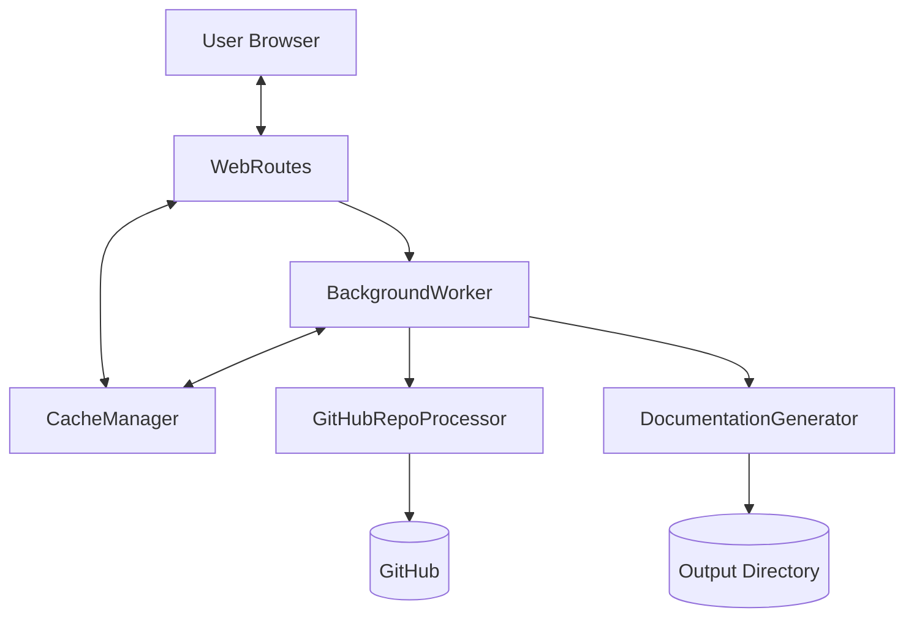
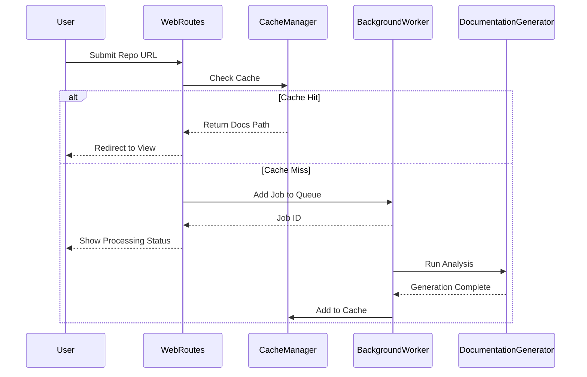

# web_frontend

The **web_frontend** module provides a comprehensive web-based user interface for the CodeWiki system, allowing users to submit GitHub repositories for automated documentation generation and view the results in a browser. It manages the full lifecycle of a documentation job, from initial request and repository cloning to background processing and final presentation.

---

## Overview
The web frontend is built using FastAPI and serves as the primary human-interactive entry point for CodeWiki. It abstracts the complexity of the documentation engine by providing:
- A submission interface for GitHub URLs and specific commit IDs.
- An asynchronous job queuing system to handle long-running generation tasks without blocking the UI.
- A robust caching layer to reuse previously generated documentation and minimize redundant LLM calls.
- A dynamic documentation viewer that renders Markdown as HTML with integrated navigation.

---

## Architecture
The following diagram illustrates the interaction between the web routes, background worker, and external services.

The architecture follows a producer-consumer pattern where **WebRoutes** produces jobs into a queue managed by the **BackgroundWorker**. This decoupling ensures the web interface remains responsive while the resource-intensive documentation generation occurs in a dedicated background thread.

---

## Core Components

> **Start here:** [`WebRoutes`](../codewiki/src/fe/routes.py#L25) — read its `index_get()` and `index_post()` methods to understand the request flow.

### WebRoutes
The [`WebRoutes`](../codewiki/src/fe/routes.py#L25) class defines the FastAPI endpoint handlers. It manages the logic for displaying the submission form, handling repository submissions, and serving generated documentation files.

- **Primary Entry Point**: `index_post(request, repo_url, commit_id)` processes new submissions, validates URLs, checks the cache, and enqueues new jobs.
- **Documentation Viewing**: `serve_generated_docs(job_id, filename)` loads generated Markdown files and converts them to HTML for browser viewing using [`StringTemplateLoader`](../codewiki/src/fe/template_utils.py#L10).

### BackgroundWorker
The [`BackgroundWorker`](../codewiki/src/fe/background_worker.py#L26) handles the asynchronous execution of documentation jobs in a dedicated thread. It monitors a queue and invokes the core [`DocumentationGenerator`](../codewiki/src/be/documentation_generator.py#L29).

- **Job Processing**: `_process_job(job_id)` orchestrates the cloning of the repository via [`GitHubRepoProcessor`](../codewiki/src/fe/github_processor.py#L14) and triggers the analysis engine.
- **Persistence**: It uses `save_job_statuses()` to persist the state of all current and historical jobs to `jobs.json` in the cache directory.

### CacheManager
The [`CacheManager`](../codewiki/src/fe/cache_manager.py#L16) provides a performance optimization layer by storing and retrieving paths to previously generated documentation.

- **Validation**: `get_cached_docs(repo_url)` checks if a valid (non-expired) documentation set exists for a given repository by comparing the repository URL hash.
- **Indexing**: It maintains a `cache_index.json` mapping repository hashes to their respective local documentation paths and access metadata.

### GitHubRepoProcessor
The [`GitHubRepoProcessor`](../codewiki/src/fe/github_processor.py#L14) contains static utilities for interacting with GitHub.

- **URL Validation**: `is_valid_github_url(url)` ensures submitted strings follow the standard `github.com/owner/repo` pattern.
- **Cloning**: `clone_repository(clone_url, target_dir, commit_id)` performs shallow or full clones to prepare the source code for analysis, supporting specific commit checkouts.

### Data Models
The module uses several Pydantic and Dataclass models to ensure type safety and structured data handling.

| Component | Type | Description |
|-----------|------|-------------|
| [`JobStatus`](../codewiki/src/fe/models.py#L33) | Dataclass | Tracks the lifecycle of a job (queued, processing, completed, failed). |
| [`CacheEntry`](../codewiki/src/fe/models.py#L49) | Dataclass | Stores metadata for cached documentation including last access time. |
| [`RepositorySubmission`](../codewiki/src/fe/models.py#L12) | Pydantic | Validates incoming web form data using URL-specific constraints. |
| [`JobStatusResponse`](../codewiki/src/fe/models.py#L17) | Pydantic | Defines the API response structure for job status queries. |

---

## Usage & Extension

### Configuration
The web application is configured via the [`WebAppConfig`](../codewiki/src/fe/config.py#L10) class, which centralizes directory paths and operational limits.

| Parameter | Type | Default | Description |
|-----------|------|---------|-------------|
| `CACHE_DIR` | str | `./output/cache` | Directory for cache indices and job logs. |
| `TEMP_DIR` | str | `./output/temp` | Temporary storage for cloned repositories during processing. |
| `QUEUE_SIZE` | int | `100` | Maximum number of concurrent jobs in the processing queue. |
| `CACHE_EXPIRY_DAYS` | int | `365` | Number of days documentation remains valid in cache. |
| `CLONE_TIMEOUT` | int | `300` | Seconds to wait for a git clone to complete before timing out. |

### Process Flow
The following sequence diagram shows the typical workflow for a repository submission.

### Error Handling
The module implements comprehensive error tracking through the [`JobStatus`](../codewiki/src/fe/models.py#L33) model.
- If a clone fails or the documentation engine crashes, the `status` is set to `failed` and the `error_message` is populated.
- Users can retry failed jobs after a cooldown period defined by `RETRY_COOLDOWN_MINUTES` in [`WebAppConfig`](../codewiki/src/fe/config.py#L10).
- Standard FastAPI `HTTPException` is raised for invalid job IDs or missing documentation files.

---

## Integration
The **web_frontend** module acts as an orchestrator for several other system components:
- **Documentation Engine**: It invokes [`DocumentationGenerator`](../codewiki/src/be/documentation_generator.py#L29) from the [documentation_engine](documentation_engine.md) module to perform the actual source code analysis.
- **Core Utilities**: It utilizes global settings from [`Config`](../codewiki/src/config.py#L52) and uses [`FileManager`](../codewiki/src/utils.py#L10) for structured I/O operations as documented in [core_system_utilities](core_system_utilities.md).
- **CLI**: While distinct, both this module and the [cli](cli.md) use the same underlying documentation generation adapters, ensuring consistent output regardless of the entry point.